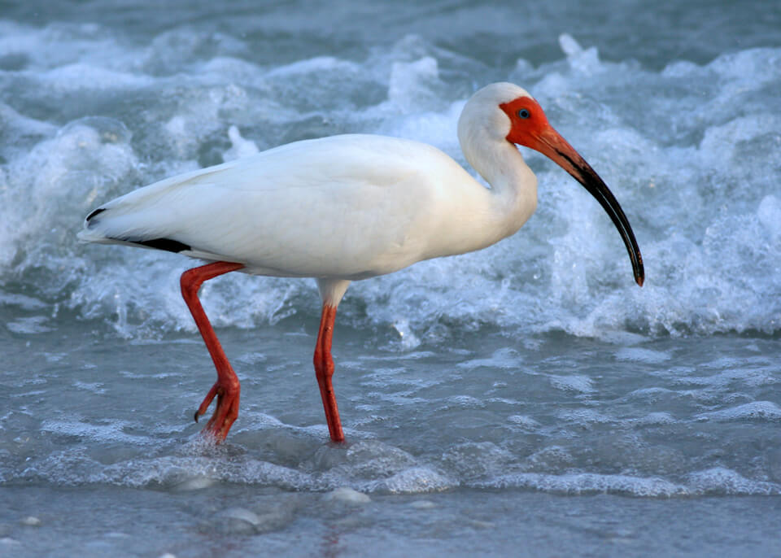

<content-header icon="waterbirds" title="White ibis" subtitle="Eudocimus albus"></content-header>

<figcaption>Photo: FWC</figcaption>

### Overall vulnerability:

This species was not assessed for vulnerability.

<h3>Habitat area: 
<a href="/species/birds/172/map" style="float:right;font-size:smaller;margin-right: 2rem;">
<fa-icon name="map"></fa-icon>
explore on map
</a>
</h3>

-   4,188,604 hectares within Florida (modeled)

### Conservation status:

Species of Greatest Conservation Need

## General Information

This elegant, white wading bird is most easily identified by its distinct long, downcurved pink bill, used to probe the ground for prey.  The white ibis eats a varied diet of crayfish, crabs, frogs, snakes and insects throughout its wide range encompassing most of Florida as well as other parts of North and South America and the Caribbean.  White ibis breed in large colonies along the coast and inland between February and October, with breeding season peaking during the spring and summer.  Ibis build nests out of twigs and roots both on the ground and as high as 50 feet above the ground in trees.  Both mates share in incubating eggs and caring for chicks during the month after hatching when youngsters remain in the nest.

## Habitat Requirements

White ibis occupy a wide range of coastal marsh and wetland habitat types.  Generalists in both foraging and nesting habitat, these birds can feed and nest in fresh, brackish and saltwater environments.

**TODO: habitat crosslinks**

## Climate Impacts

The white ibis is currently threatened by habitat loss and fragmentation in Florida and shifting land use linked to climate change is likely to intensify this threat, especially in coastal areas.  The ibis’s fresh and brackish water habitats are highly vulnerable to sea level rise and salt water encroachment.  Although this species may be able to successfully adapt to changes in salinity, the quality of habitat and availability of prey may decline.  Coastal armoring in response to sea level rise and extreme weather and disturbance events are also likely to negatively impact the species.

[More information about general climate impacts to species in Florida](/impacts/species).

#### This species is expected to be impacted by sea level rise:

- 3 meters of sea level rise: 39% of area (1,618,722 ha)
- 1 meter of sea level rise: 22% of area (936,709 ha)

[Explore sea level rise impacts map](/species/birds/172/map).

## Vulnerability Assessment(s)

This species was not assessed for vulnerability.

## Adaptation Strategies

- Addressing existing threats including conserving existing aquatic habitat from further development to the extent possible is an important first-line adaptation strategy for this species.

- Protection of habitat corridors that allow the white ibis to move within patches of suitable habitat as natural climate-driven shifts occur may help this species adapt.

[More information about adaptation strategies](/strategies).

## Additional Resources

- [Florida Fish and Wildlife Conservation Commission Species Profile](https://myfwc.com/wildlifehabitats/profiles/birds/waterbirds/white-ibis/)
