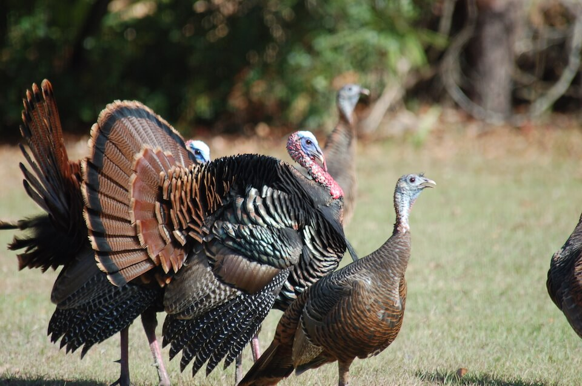

# Wild turkey

### Meleagris gallopavo

<figcaption>Photo: FWC</figcaption>

### Overall vulnerability:

This species was not assessed for vulnerability.

### Conservation status:

Species of Greatest Conservation Need

## General Information

Florida is home to two subspecies of wild turkey, a popular game bird in the state and elsewhere - the eastern wild turkey and the Florida wild turkey.  Florida wild turkeys are difficult to distinguish from their eastern congeners, save for their wings, which take on a darker appearance.  Florida wild turkeys are more common in the peninsula while eastern wild turkeys tend to occupy the panhandle.  Turkeys are robust birds and powerful fliers for short distances – capable of achieving speeds up to 55 miles per hour.  To conserve energy however, turkeys spend most of their time on the ground, preferring to walk in search of acorns, seeds and other food items.  Wild turkeys are highly social and can often be found in groups of up to 20 individuals.  To avoid predators, turkeys roost in trees at night before returning to the ground for foraging during the day.

## Habitat Requirements

**Total habitat within Florida:** 5,868,076 hectares (modeled)

The wild turkey is a woodland species that prefers forest edges and open stands of trees.  Turkeys are habitat generalists and opportunistic foragers, thus they can and do occupy many different forested habitat types throughout the state.  While wild turkeys are flexible in their habitat requirements, this species does require a certain type of vegetative structure to thrive.  Low, herbaceous ground cover in proximity to forest canopy allows these cautious birds to see and avoid predators while still providing ample food supply.

**TODO: habitat crosslinks**

**TODO: habitat map (if exists)**

## Climate Impacts

Wild turkeys are vulnerable to habitat loss and fragmentation in Florida that is likely to be compounded by climate change.  Vegetative community structure is likely to change following climate-driven shifts in hydrological cycles, precipitation patterns, temperature extremes and prescribed fire regimes.  Habitat fragmentation and decline could impact the ability of wild turkeys to successfully breed, forage and avoid predation.  If wild turkey populations in Florida move to follow quality habitat, distinct subspecies could be lost to genetic flooding.

[More information about general climate impacts to species in Florida](/impacts/species).

#### This species is expected to be impacted by sea level rise:

- 3 meters of sea level rise: 6% of habitat (359,441 ha)
- 1 meter of sea level rise: 2% of habitat (120,192 ha)
    

## Vulnerability Assessment(s)

This species was not assessed for vulnerability.

## Adaptation Strategies

- Monitoring natural shifts in ecological communities to prioritize areas for conservation in a changing climate is an important first step adaptation strategy for the wild turkey.

- Implementing an appropriate fire regime is an important adaptive management strategy to pursue in many areas of wild turkey habitat.  Climate change is likely to make prescribed fire more challenging as optimal burning conditions become increasingly rare, thus implementing a consistent fire management regime early is crucial.

- Preserving large, connected patches of suitable habitat allowing turkeys to move freely to find the most suitable habitat in a changing landscape will be critical as climate-driven shifts in habitat quality and composition intensify.

[More information about adaptation strategies](/strategies).

## Additional Resources

- [Florida Fish and Wildlife Conservation Commission Species Profile](https://myfwc.com/wildlifehabitats/profiles/birds/game-birds/wild-turkeys/)
