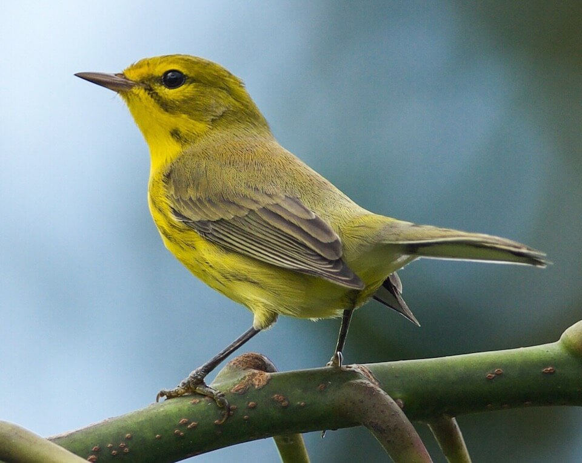

<content-header icon="perching_birds" title="Florida prairie warbler" subtitle="Dendroica discolor"></content-header>

<figcaption>Photo: Brandon Trentler</figcaption>

### Overall vulnerability:

Moderate

### Conservation status:

Species of Greatest Conservation Need

## General Information

The Florida prairie warbler is found throughout much of the southeastern United States, but most consistently occurs in coastal Florida. These small birds nest in mangroves and are typically low-lying, moving about the brush and debris of the forest floor. Florida prairie warblers subsist on insects and occasionally berries and feed their nestlings a diet rich with caterpillars. Young are cared for by both parents, with fledglings leaving the nest at 8-11 days after hatching. After gaining their mobility, young warblers remain with and are cared for by their parents for about 40-50 days longer. Males return to the same breeding area annually, while females often do not.

## Habitat Requirements

Low-lying brush, tall grasses, and mangrove roots are all important components of Florida prairie warbler habitat. The prairie warbler often appears in freshly cleared or burned forests, leaving after the forest matures past an early successional state. This species is restricted to warmer climates, mostly occurring on the southern end of the eastern coast of the United States.

**TODO: habitat crosslinks**

## Climate Impacts

The Florida prairie warbler is a migratory bird species, although some birds remain in Florida year-round.  As seasonal changes and variabilities accelerate under climate change, the nesting and migration patterns of this species could be impacted, possibly making successful reproduction more challenging.  Much of the prairie warbler’s current breeding habitat is vulnerable to sea level rise and habitat destruction and fire suppression are additional looming threats for this species.

[More information about general climate impacts to species in Florida](/impacts/species).

## Vulnerability Assessment(s)

The overall vulnerability level (Moderate) was based on the following assessment(s).
#### 

<h3><a href="/impacts/vulnerability/sivva/species">Standardized Index of Vulnerability and Value Assessment</a></h3>

Moderately vulnerable

 

The primary factors contributing to vulnerability of the Florida prairie warbler are sea level rise, erosion, presence of barriers, habitat fragmentation, runoff and storm surge, alterations to biotic interactions, and synergies with development.

## Adaptation Strategies

- Conserving healthy future mangrove and coastal habitat as sea levels rise and human communities begin to shift is important for this species.

- Protecting migratory corridors if mangrove habitat migrates inland and northward is an important adaptation strategy for this species.  Assisted migration to optimal mangrove breeding habitat northward from the bird’s current range in a future climate is a possible strategy.

- Implementing an optimal burning regime is important habitat maintenance for the Florida prairie warbler.  As controlled burning becomes more challenging in a changing climate, other habitat management strategies such as mechanical thinning may need to be pursued to maintain habitat quality for this species.

[More information about adaptation strategies](/strategies).

## Additional Resources

- [Florida Fish and Wildlife Conservation Commission Species Profile](http://legacy.myfwc.com/bba/docs/bba_PRWA.pdf)
