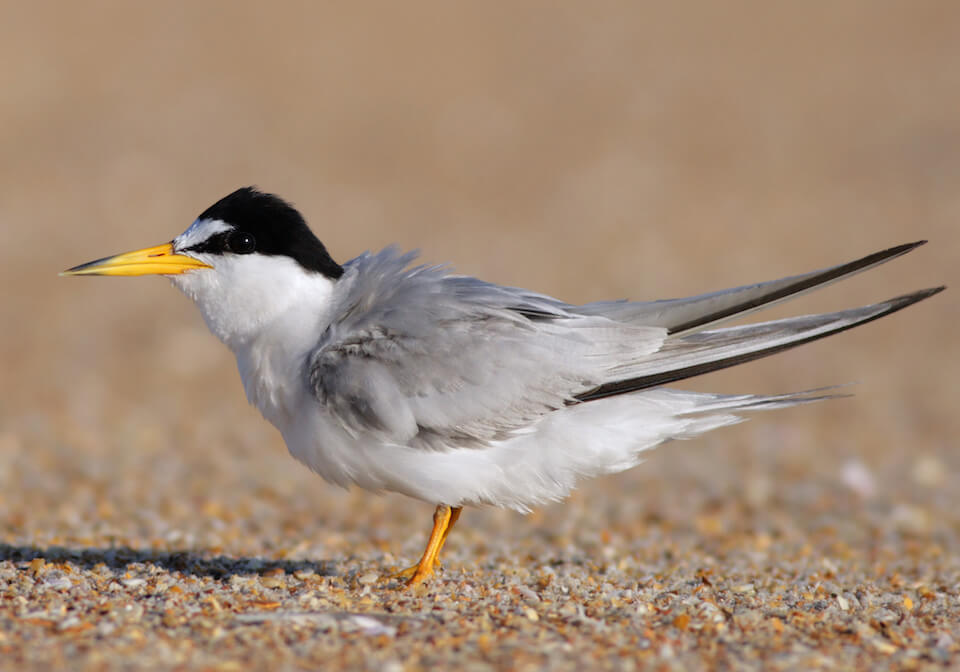

# Least tern

### Sternula antillarum

<figcaption>Photo: FWC</figcaption>

### Overall vulnerability:

Moderate

### Conservation status:

State Threatened

## General Information

The least tern is the smallest tern in North America with a wingspan of about 21 inches. These birds have white undersides with gray topsides and bright yellow beaks.  Least terns nest in the sand during their annual spring breeding season but are also known to nest on gravel rooftops.  Least tern offspring become active and begin exploring outside of their nests about three days after hatching. This species feeds primarily on small fish and invertebrates from the surrounding sea.  Least tern have a range that includes both coasts of Florida as well as the Atlantic coast of the United States.  The southern end of their range stretches into Mexico and Argentina.

## Habitat Requirements

Least terns occupy a range of coastal habitat types including estuaries and bays.  They can be found near rivers and other bodies of freshwater at various locations throughout their range as well.

**TODO: habitat crosslinks**

**TODO: habitat map (if exists)**

## Climate Impacts

Least terns face several climate-related threats within their coastal habitat. The majority of current least tern habitat in Florida is likely to be impacted be moderate sea level rise.  Changing weather patterns such as increased storms and prolonged colder temperatures are an immediate threat to nesting terns and their young. Strong storm events can cause direct mortality to young nestlings.  Habitat loss and fragmentation is an ongoing threat that is likely to intensify under shifting land use patterns associated with climate change.  Higher temperatures in a future climate may decrease reproductive success in this species as eggs can be lost to overheating.  This threat is magnified by human disturbance near sensitive nesting areas, which can cause terns to startle from their nests, leaving their eggs to overheat.  Although the least tern likely faces some negative impacts related to climate change, the wide range and mobility of this species provides protection and increases its adaptive capacity.

[More information about general climate impacts to species in Florida](/impacts/species).

## Vulnerability Assessment(s)

The overall vulnerability level (Moderate) was based on the following assessment(s).
#### 

<h3><a href="/impacts/vulnerability/ccvi">Climate Change Vulnerability Index</a></h3>

Highly vulnerable

 

The major factors contributing to the vulnerability of the least tern include sea level rise, anthropogenic barriers that may inhibit the species ability to track climatic shifts, and potentially incompatible human responses to climate change.  Other potential risk factors associated with greater uncertainty include temperature effects on egg and chick survival and adverse impacts from more intense hurricanes.  Between 15-100% of the species' range is expected to be impacted by a 1-meter sea level rise. The range is primarily due to uncertainty regarding the percentage of the population occupying gravel-covered rooftops.    When birds are disturbed and fly off the nest, eggs are sometimes killed by heat, suggesting that eggs may be much more dependent on a cooler microhabitat (i.e., shade) and would be more at risk under climate change.  Changes to hydrology may potentially impact food supply, particularly for resources needed for chicks. Increased storms would likely create some new nesting habitat for the species, however changes in the timing or intensity of storms during spring/summer could increase egg mortality resulting from storm overwash. In addition, increased turbidity resulting from more intense storm activity could potentially negatively impact foraging success.

#### 

<h3><a href="/impacts/vulnerability/sivva/species">Standardized Index of Vulnerability and Value Assessment</a></h3>

Slightly vulnerable

 

The primary factors contributing to vulnerability of the least tern are sea level rise and minimal habitat protection.

## Adaptation Strategies

- Identifying and restricting human access at known nesting locations is a no-regrets strategy likely to bolster population resilience at the onset of intensifying climate change.

- Controlling nonnative predators such as rat and feral cat populations is likely to benefit this species under the increasing stress of climate change.

- Restoration of existing nesting and foraging habitat and protection of new habitat as the climate changes will afford the least tern a better chance at adapting gracefully to a changing climate.

[More information about adaptation strategies](/strategies).

## Additional Resources

- [Florida Fish and Wildlife Conservation Commission Species Profile](https://myfwc.com/wildlifehabitats/profiles/birds/shorebirdsseabirds/least-tern/)
