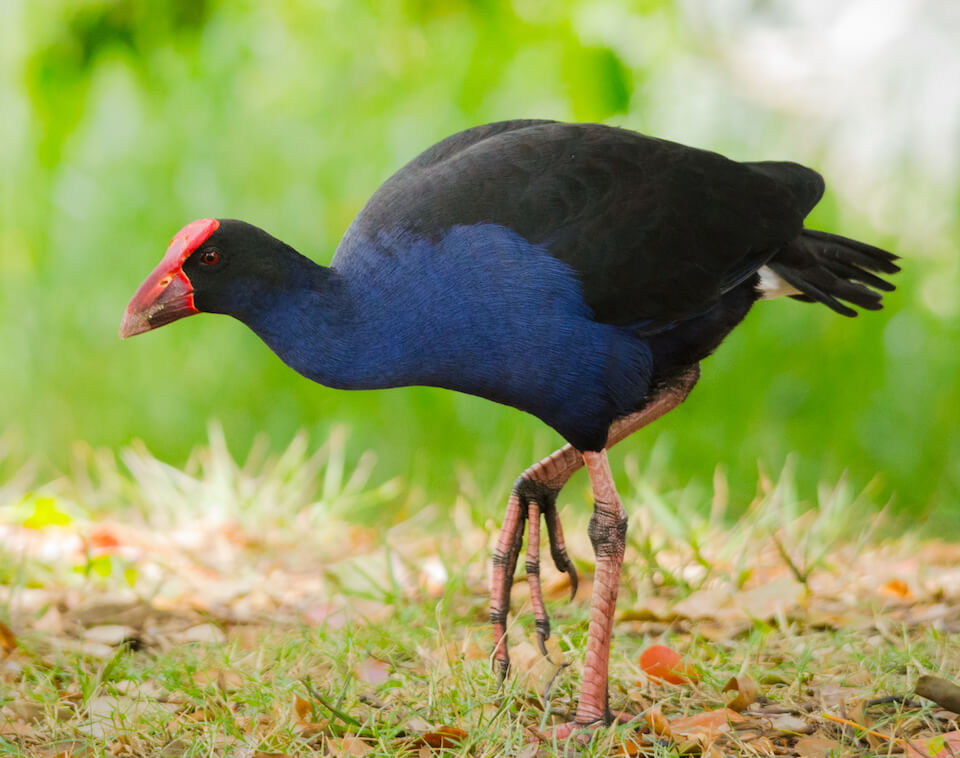

<content-header icon="waterbirds" title="Purple swamphen" subtitle="Porphyrio porphyrio">
</content-header>

<figcaption>Photo: James Niland</figcaption>

### Overall vulnerability:

Very Low

### Conservation status:

Non-native

## General Information

This stout and colorful waterbird can be identified by its indigo feathers and red, curved beak.  Purple swamphens are native to the Iberian Peninsula.  The nonnative south Florida population of this species likely originated from captive urban birds.  Purple swamphens are presently expanding their range northward in Florida.  These birds make loud bleating calls and are notably clumsy in flight.  Swamphens nest in swamp or marsh vegetation on the ground and eat a primarily vegetarian diet of wetland plant matter, supplemented with occasional reptiles, amphibians and insects.

## Habitat Requirements

Purple swamphens inhabit a variety of aquatic habitats since their expansion in Florida including floodplains, marshes, ponds, rivers and streams.

**TODO: habitat crosslinks**

## Climate Impacts

The freshwater marshes that form the bulk of purple swamphen habitat in Florida are vulnerable to changing hydrological cycles, water chemistry and salinity.  Some areas of swamphen habitat in coastal south Florida may become inundated by sea level rise.  As a nonnative species, purple swamphens may expand further in a changing climate and impact native species including wetland plants, reptiles and amphibians.

[More information about general climate impacts to species in Florida](/impacts/species).

## Vulnerability Assessment(s)

The overall vulnerability level (Very Low) was based on the following assessment(s).
#### 

<h3><a href="/impacts/vulnerability/ccvi">Climate Change Vulnerability Index</a></h3>

Not vulnerable   Presumed stable

 

The only factor identified as potentially contributing to "vulnerability" for the purple swamphen was the potential impact of changes in hydrology affecting freshwater marshes.  Good dispersal ability and tolerance for warmer temperatures, in combination with few limiting barriers, suggest that the species may be able to expand its range with climate change.  Less than 10% of the species' current range is expected to be impacted by a 1-meter sea level rise. Some habitat in extreme south Florida may be lost as sea levels rise and mangroves move into areas that were previously freshwater marsh, but this is likely to have only a minor impact.  The current population in Florida dispersed into natural areas from an urban release of captive birds, and the species is currently increasing its northern range in Florida.

## Adaptation Strategies

- As a nonnative species representing a potential threat to native wildlife, the goal is to reduce and ultimately eradicate purple swamphens from Florida rather than to help the species adapt to a changing climate.

[More information about adaptation strategies](/strategies).

## Additional Resources

- [Other Species Profile](http://ufdcimages.uflib.ufl.edu/IR/00/00/34/26/00001/UW31500.pdf)
