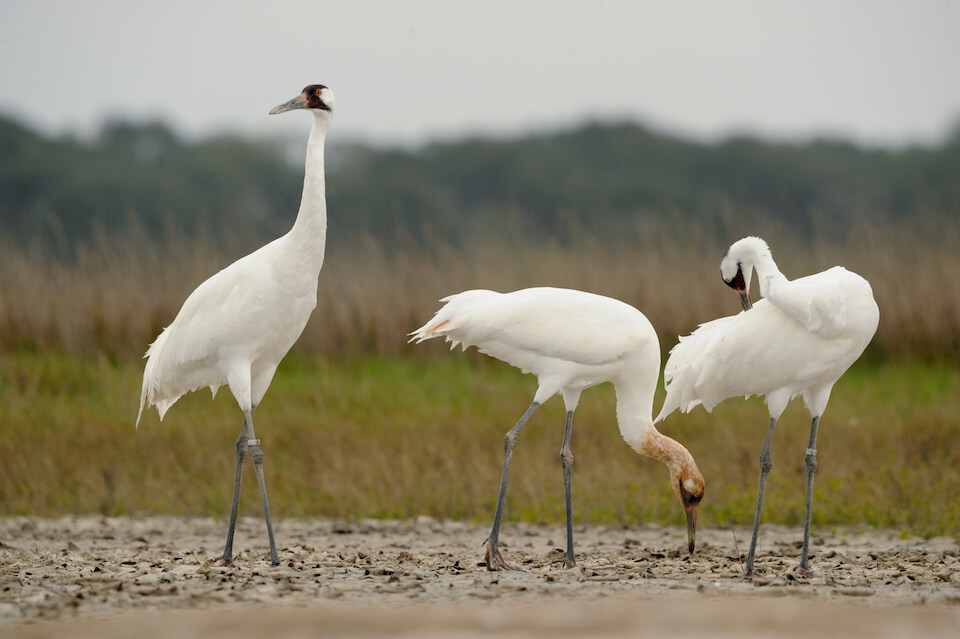

# Whooping crane

### Grus americana

<figcaption>Photo: USFWS</figcaption>

### Overall vulnerability:

Very High

### Conservation status:

Federally Listed - Experimental Population

## General Information

These elegant cranes once occupied a range that included much of the eastern United States.  Whooping cranes were recorded in Florida until the 1930s.  Efforts to reintroduce self-sustaining migratory and nonmigratory flocks to Florida have been fraught and are still ongoing.  Currently one migratory population is independently sustaining in North America with breeding grounds in Canada and wintering grounds in Texas.  Whooping cranes forage in shallow water, where they probe for plant and animal matter with their long bills.  Whooping cranes are named for their loud calls, which can carry a couple of miles in adequate conditions.

## Habitat Requirements

Whooping cranes inhabit salt and freshwater marshes, prairies and floodplains including pastures and working lands.

**TODO: habitat crosslinks**

**TODO: habitat map (if exists)**

## Climate Impacts

The Florida sandhill crane is dependent on freshwater marshes and floodplains habitats which will become highly vulnerable to drought, changes in precipitation patterns and salination from sea level rise under climate change. Habitat loss and fragmentation accelerated by changing land use patterns in the face of climate change is also likely to impact this species.

[More information about general climate impacts to species in Florida](/impacts/species).

## Vulnerability Assessment(s)

The overall vulnerability level (Very High) was based on the following assessment(s).
#### 

<h3><a href="/impacts/vulnerability/sivva/species">Standardized Index of Vulnerability and Value Assessment</a></h3>

Extremely vulnerable

 

The primary factors contributing to vulnerability of the whooping crane are the presence of barriers and alterations to biotic interactions.   Altered biotic interactions include increased disease and chick predation.  Through experimental introductions, it has been found difficult to establish new populations.

## Adaptation Strategies

- Monitoring natural community shifts to prioritize areas for conservation is an important step in ensuring potential whooping crane habitat can be conserved in a future climate.  As locations of prime crane habitat are likely to shift under climate change, monitoring can help conservationists get ahead of natural shifts and understand where to best focus their efforts.  This strategy is also important to mitigate extensive habitat loss from altered human land use patterns in a changing climate.

- As efforts to recover whooping crane populations in Florida have been relatively unsuccessful thus far, controlling existing threats such as predation by nonnative species may be a critical first step to improve outcomes for this species.

[More information about adaptation strategies](/strategies).

## Additional Resources

- [Florida Fish and Wildlife Conservation Commission Species Profile](https://myfwc.com/wildlifehabitats/profiles/birds/cranes/whooping-cranes/)

- [Federal Recovery Plan](https://ecos.fws.gov/docs/recovery_plan/070604_v4.pdf)
