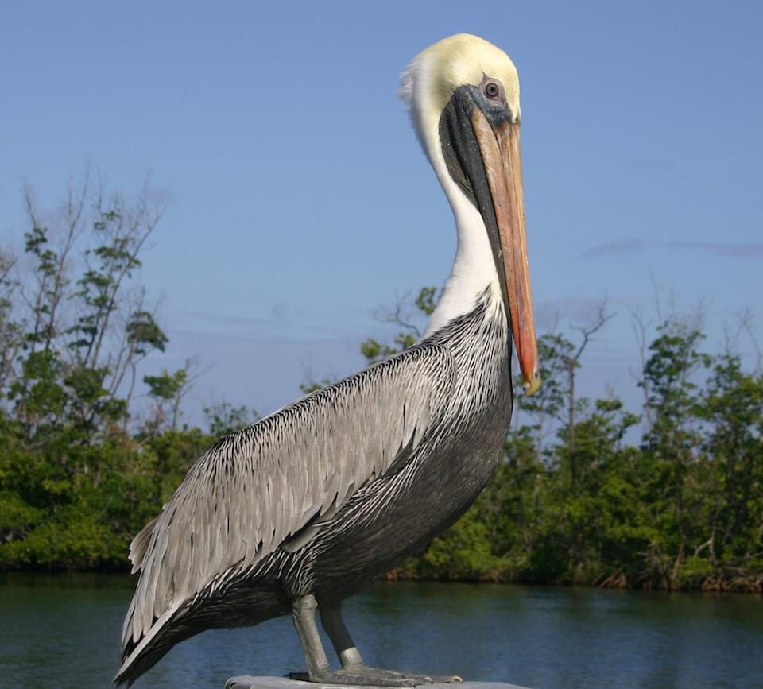

<content-header icon="shorebirds" title="Brown pelican" subtitle="Pelecanus occidentalis">
</content-header>

<figcaption>Photo: FWC</figcaption>

### Overall vulnerability:

Very Low

### Conservation status:

Species of Greatest Conservation Need

## General Information

These large shorebirds are easy to identify by their long bills.  Brown pelicans are common residents of both coasts of North and South America.  Pelicans are adapted to eat fish, and fishing is a skill they have perfected over their long history.  Pelicans have remarkable eyesight and they can dive steeply, submerging themselves in the water to capture prey in their throat pouches.  Brown pelicans are highly social and nest in large colonies, typically building their nests in trees or shrubs near the shoreline.

## Habitat Requirements

Brown pelicans can be found along both coasts of the Americas.

**TODO: habitat crosslinks**

## Climate Impacts

The majority of current brown pelican habitat in Florida is likely to be impacted be moderate sea level rise.  Changing weather patterns such as increased storms and prolonged colder temperatures present a possible threat to nesting pelicans and their young. Strong storm events can cause direct mortality to young nestlings.  Habitat loss and fragmentation is an ongoing threat that is likely to intensify under shifting land use patterns associated with climate change.  Although the brown pelican likely faces some negative impacts related to climate change, the wide range and mobility of this species provides protection and increases its adaptive capacity.

[More information about general climate impacts to species in Florida](/impacts/species).

## Vulnerability Assessment(s)

The overall vulnerability level (Very Low) was based on the following assessment(s).
#### 

<h3><a href="/impacts/vulnerability/sivva/species">Standardized Index of Vulnerability and Value Assessment</a></h3>

Slightly vulnerable

 

No factors identified as significantly contributing to the vulnerability of the Suwannee cooter.

## Adaptation Strategies

- Identifying and restricting human access at known nesting locations is a no-regrets strategy likely to bolster population resilience at the onset of intensifying climate change.

- Controlling nonnative predators is likely to benefit this species under the increasing stress of climate change.

- Limiting coastal development and shoreline hardening will benefit this species as climate change accelerates.

[More information about adaptation strategies](/strategies).

## Additional Resources

- [Florida Fish and Wildlife Conservation Commission Species Profile](https://myfwc.com/wildlifehabitats/profiles/birds/shorebirdsseabirds/brown-pelican/)
