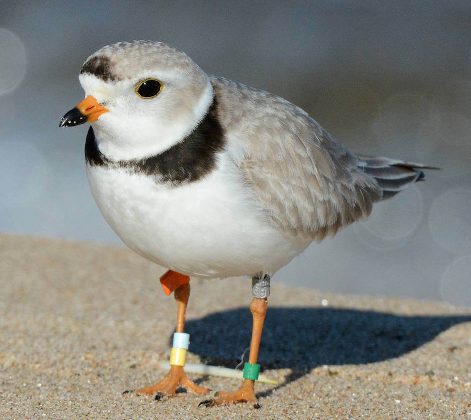

<content-header icon="shorebirds" title="Piping plover" subtitle="Charadrius melodus"></content-header>

<figcaption>Photo: FWC</figcaption>

### Overall vulnerability:

Moderate

### Conservation status:

Federally Threatened

## General Information

The piping plover is a small shorebird, with a two-tone bill, bright yellow legs, and a white or gray underside. This bird spends much of the year wintering in Florida before returning to southern Canada to breed in pairs. During March and April, males will perform their courtship rituals before constructing a nest with their mates. The nests are constructed in the bare sand, where the piping plovers will dig small depressions into the ground, sometimes lining their nests with pebbles. This bird’s offspring are independent and begin to forage with their parents shortly after hatching. Piping plovers will mainly eat insects, marine worms, and small crustaceans from the nearby shores.

## Habitat Requirements

The Piping Plover inhabits beach and surf zones along the coasts. This species spends its winters in Florida, the Gulf Coast, and Mexico. When it becomes sufficiently warm in the north, they return to their breeding grounds in southern Canada and the northern United States.

**TODO: habitat crosslinks**

## Climate Impacts

Changing weather patterns and more extreme temperatures can affect the piping plover’s migratory patterns. In addition to climatic threats, interaction with human developments and populations can increase the rates of disturbed nests and offspring mortality. Development of coastal areas that piping plovers use to winter decreases available habitat for this species in Florida.

[More information about general climate impacts to species in Florida](/impacts/species).

## Vulnerability Assessment(s)

The overall vulnerability level (Moderate) was based on the following assessment(s).
#### 

<h3><a href="/impacts/vulnerability/sivva/species">Standardized Index of Vulnerability and Value Assessment</a></h3>

Highly vulnerable

 

The primary factors contributing to vulnerability of the piping plover are sea level rise, erosion, presence of barriers, runoff and storm surge, alterations to biotic interactions, and synergies with development.

## Adaptation Strategies

- Restoration and protection of existing coastal habitat is important for the piping plover.  As climate change begins to accelerate, protecting areas of future habitat allowing for natural coastal migration not impeded by human development may benefit this species.

[More information about adaptation strategies](/strategies).

## Additional Resources

- [Florida Fish and Wildlife Conservation Commission Species Profile](https://myfwc.com/wildlifehabitats/profiles/birds/shorebirdsseabirds/piping-plover/)

- [Federal Recovery Plan](https://ecos.fws.gov/docs/recovery_plan/960502.pdf)

- [Multi-Species Recovery Plan for South Florida](https://ecos.fws.gov/docs/recovery_plan/sfl_msrp/SFL_MSRP_Species.pdf)
