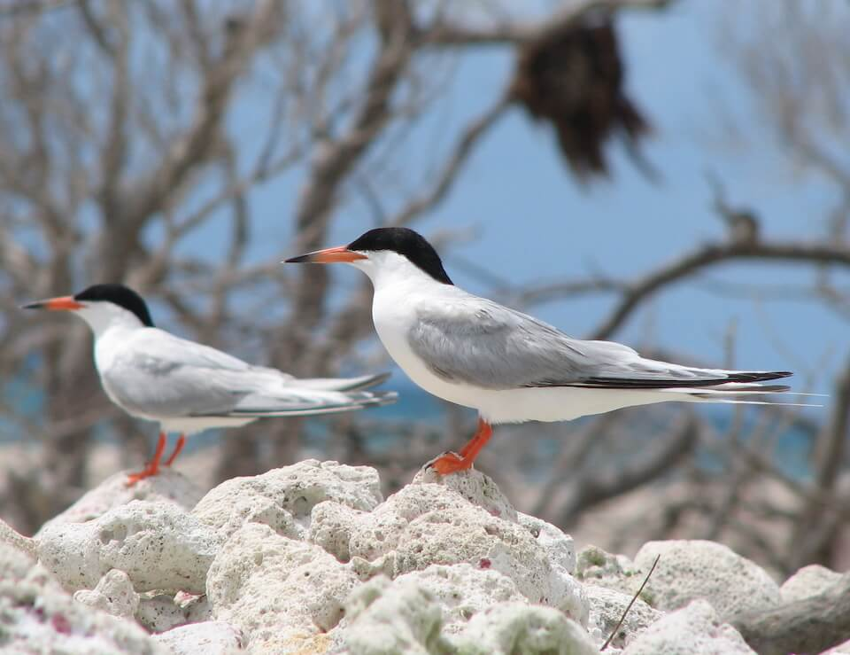

<content-header icon="shorebirds" title="Roseate tern" subtitle="Sterna dougallii dougallii">
</content-header>

<figcaption>Photo: FWC</figcaption>

### Overall vulnerability:

Low

### Conservation status:

Federally Threatened

## General Information

The roseate tern is a midsized tern, with a wingspan of approximately 24 inches. These birds have white undersides with gray topsides. Roseate terns have thin black beaks that change color during breeding seasons to a bright red. During breeding seasons, Roseate terns nest in large colonies along with other tern species. Males will perform their courtship rituals during the month of May and adults will incubate eggs for the following three weeks. Roseate tern offspring leave their parents at two months of age. This species feeds primarily on small fish and invertebrates from the surrounding sea. The roseate tern occupies a large, global geographic range with populations observed from as far north as Nova Scotia to as far south as Australia.

## Habitat Requirements

Within Florida, roseate terns are found in the Keys, where they nest on bare limestone, coral deposits, and sandy beaches. This tern is not picky when it comes to nesting location, provided there is a steady supply of small fish to feed on from the surrounding waters.

## Climate Impacts

Roseate terns face several climate-related threats within their coastal habitat. The majority of current roseate tern habitat is likely to be impacted be moderate sea level rise.  Changing weather patterns such as increased storms and prolonged colder temperatures are an immediate threat to nesting terns and their young. Strong storm events can cause direct mortality to young nestlings.  Habitat loss and fragmentation is an ongoing threat that is likely to intensify under shifting land use patterns associated with climate change.  Higher temperatures in a future climate may decrease reproductive success in this species as eggs can be lost to overheating.  This threat is magnified by human disturbance near sensitive nesting areas, which can cause terns to startle from their nests, leaving their eggs to overheat.  Although the roseate tern likely faces some negative impacts related to climate change, the wide range and mobility of this species provides protection and increases its adaptive capacity.

[More information about general climate impacts to species in Florida](/impacts/species).

## Vulnerability Assessment(s)

The overall vulnerability level (Low) was based on the following assessment(s).
#### 

<h3><a href="/impacts/vulnerability/sivva/species">Standardized Index of Vulnerability and Value Assessment</a></h3>

Moderately vulnerable

 

The primary factors contributing to vulnerability of the roseate tern are sea level rise, habitat fragmentation, and alterations to biotic interactions.

## Adaptation Strategies

- Identifying and restricting human access at known nesting locations is a no-regrets strategy likely to bolster population resilience at the onset of intensifying climate change.

- Controlling nonnative predators such as rat and feral cat populations is likely to benefit this species under the increasing stress of climate change.

- Restoration of existing nesting and foraging habitat and protection of new habitat as the climate changes will afford the roseate tern a better chance at adapting gracefully to a changing climate.

[More information about adaptation strategies](/strategies).

## Additional Resources

- [Florida Fish and Wildlife Conservation Commission Species Profile](https://myfwc.com/wildlifehabitats/profiles/birds/shorebirdsseabirds/roseate-tern/)

- [Multi-Species Recovery Plan for South Florida](https://ecos.fws.gov/docs/recovery_plan/sfl_msrp/SFL_MSRP_Species.pdf)
