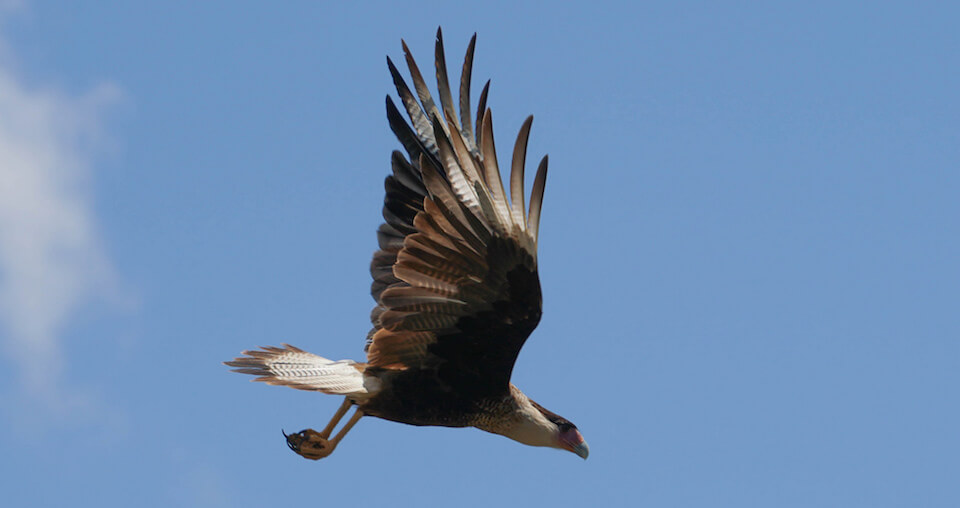

<content-header icon="birds" title="Birds"></content-header>

Approximately 377 species of native birds make their home in Florida’s skyways, including 15 federally listed and 17 state listed species. Many of these species inhabit the state year-round including large populations of shorebirds, seabirds and cranes.

<!-- https://www.flickr.com/photos/bigcypressnps/41935562374/ -->

While the long-range and ability to move across a fragmented landscape in flight may increase the resiliency of some bird species in the face of climate change, many birds are still highly vulnerable. Florida’s shorebirds largely depend on fragile estuarine habitats that are likely to be dramatically altered by sea level rise. Many birds, especially beach nesting species, are also highly vulnerable to the increased severe storm events anticipated with climate change.
