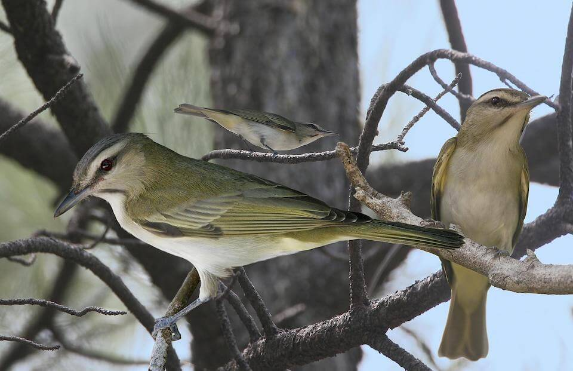

# Black-whiskered vireo
### *Vireo altiloquus*

**Conservation status:** Species of Greatest Conservation Need

**TODO:vulnerability**

The black-whiskered vireo can be distinguished from the red-eyed vireo by its unique song and the dark stripe along the sides of its throat, for which it is named.  The bird’s breeding range extends from central Florida through the Bahamas and into the Caribbean.  Black-whispered vireos arrive in Florida in the early spring to nest in the forks and crevices of mangrove trees through the summer breeding season.  The black-whiskered vireo relies on a diet of insects and invertebrates, with small supplements of fruit and plant-based matter.  After fledging chicks, these birds depart for their South American wintering grounds in the fall.

    
## Habitat Requirements

Ideal black-whiskered vireo habitat consists of red mangrove swamps and tropical hardwood forests in the southern portion of the state.

## Climate Impacts

The black-whiskered vireo’s range is closely linked to its preferred habitat type – mangrove swamps.  As mangroves have expanded northward in Florida in the recent past, so have black-whiskered vireos.  Although much of the black-whiskered vireo’s current breeding habitat is highly vulnerable to sea level rise, as a migratory species this bird had the ability to move to follow the mangroves.  As mangroves expand further northward and inland under climate change, so may the black-whiskered vireo.  However, much of the bird’s current habitat falls within protected areas, such as Everglades National Park.  If natural habitat shifts under climate change conflict with human development patterns, the bird may lose critical breeding habitat.

## Adaptation Strategies

- Conserving areas of new potential habitat where mangrove migration will occur is an important adaptation strategy for the black-whiskered vireo.  Relying on current protected habitat that is highly vulnerable to sea level rise, is likely to leave this bird without adequate breeding habitat in Florida as climate change accelerates.

- Monitoring natural community shifts to prioritize areas for conservation is an important first step in ensuring ideal black-whiskered vireo habitat can be protected in a future climate.  Since the bird’s preferred habitat is likely to change along with the climate, monitoring can help conservationists get ahead of natural shifts and understand where to best focus their efforts.

[More information about adaptation strategies](/strategies).
