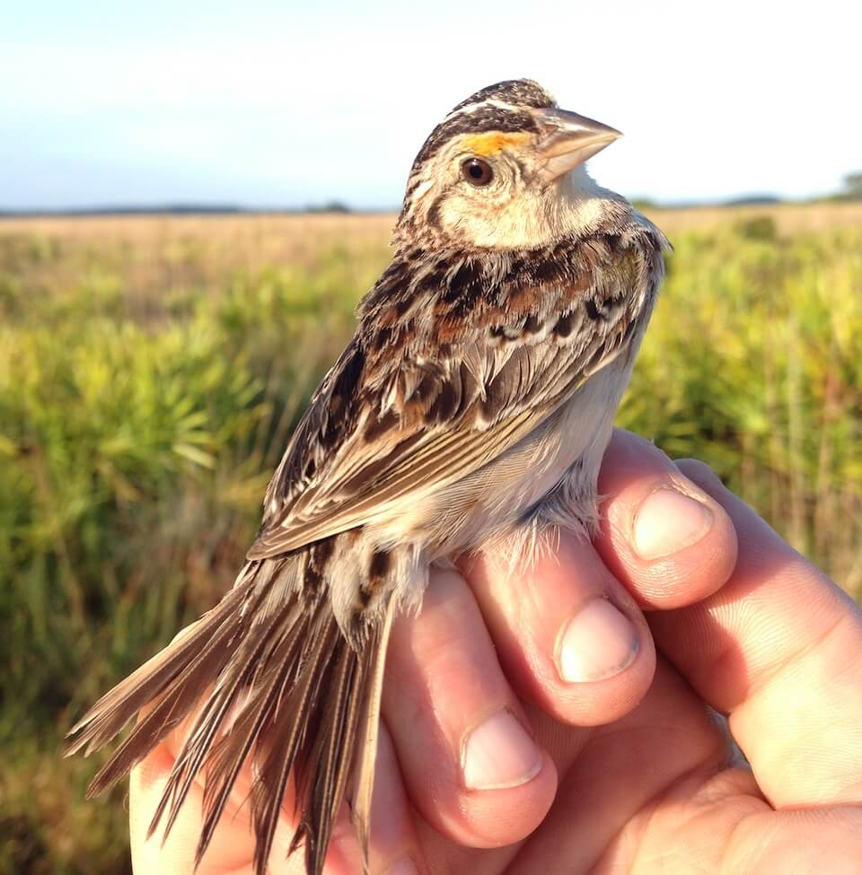

# Florida grasshopper sparrow
### *Ammodramus savannarum floridanus*

**Conservation status:** Federally Endangered

**TODO:vulnerability**

The Florida grasshopper sparrow is a non-migratory subspecies found only in the grasslands of central Florida.  Widespread habitat loss across its limited range has precipitated dramatic population decline and this sparrow is now regarded as the most endangered species of bird in the continental United States despite extensive conservation efforts in recent years.  This tiny sparrow blends expertly with its habitat and is generally heard before it is seen.  During their spring breeding season, female grasshopper sparrows build dome-shaped nests made of grass and other vegetation on the ground.  Although they face the many threats of predation and disruption that are common to ground-nesting birds, grasshopper sparrow nests camouflage exceptionally well in the landscape.

    
## Habitat Requirements

The Florida grasshopper sparrow requires large, treeless expanses of dry prairie that are largely dependent on frequent fire.  Grasshopper sparrows can be found foraging amongst low shrubs and bunch grasses interspersed with bare ground that allows for effective foraging.

## Climate Impacts

The Florida grasshopper sparrow is extremely vulnerable to the impacts of climate change in large part due to its current conservation status.  Ground nesting bird species are very susceptible to nest failure due to predation as well as natural disturbances.  While it is not uncommon for a breeding pair to nest several times in a season after failure, nest failure too many times or too late in a season can have dramatic impacts on population size.  Catastrophic population-wide nest failures are likely to become a more common occurrence as severe storm and extreme weather events become more common under climate change.  The grasshopper sparrow’s current population is so critically low that it would be difficult for the species to withstand even one season of widespread nest failure.  Increased habitat loss as humans move inland under climate change is also likely to impact the Florida grasshopper sparrow.

## Adaptation Strategies

- Implementing an appropriate fire regime is one of the most important adaptive management strategies for the Florida grasshopper sparrow.  Climate change is likely to make prescribed fire more challenging as optimal burning conditions become increasingly rare, thus implementing a consistent fire management regime early is crucial.

- As controlled burning becomes more challenging in a changing climate, other habitat management strategies such as mechanical thinning may need to be pursued to conserve adequate grassland habitat for the Florida grasshopper sparrow.

- Given the extreme vulnerability of this species to extinction from a natural disturbance event as climate change accelerates, more extreme strategies such as development of a captive breeding program and assisted migration may warrant consideration.

[More information about adaptation strategies](/strategies).

## Additional Resources

- [Multi-Species Recovery Plan for South Florida](https://ecos.fws.gov/docs/recovery_plan/sfl_msrp/SFL_MSRP_Species.pdf)
