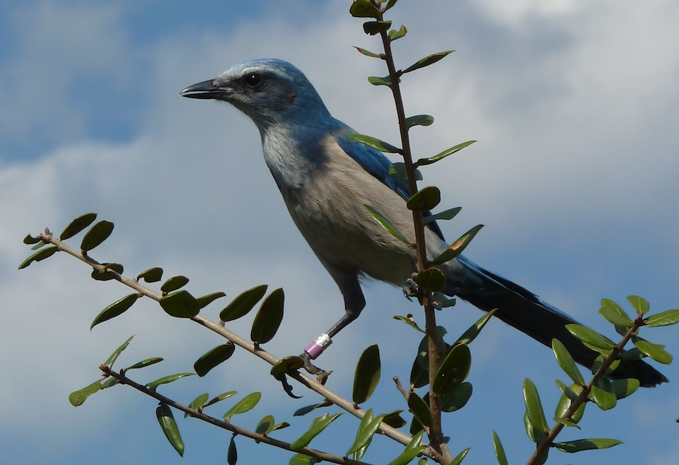

# Florida scrub jay
### *Aphelocoma coerulescens*

**Conservation status:** Federally Threatened

**TODO:vulnerability**

The Florida scrub jay is the only species of bird endemic to Florida.  As a result, this species is highly sought-after by birders who travel across the country to catch a glimpse.  Within Florida, these birds range throughout much of the peninsula where they live in family groups consisting of parents and their offspring. Florida scrub jays are omnivorous, relying on a diet of lizards, insects, mice, acorns and bird eggs.  Scrub jays have a short breeding season extending from March through June. Eggs are incubated for 18 days and juvenile Florida scrub jays are ready to depart the nest another 18 days after hatching.  However, young birds typically stay with their parents for one to two years before separating and developing their own territory.

    
## Habitat Requirements

Florida scrub jays thrive in areas with large quantities of oak shrub habitat.  They are found in sand pine and xeric oak scrub, in some of the highest and driest lands in Florida.  The ancient sandy ridges running down the middle of the peninsula and old sand dunes near the coast make for excellent scrub jay  habitat.

## Climate Impacts

The Florida scrub jay’s population has been decimated by habitat loss, fragmentation and fire suppression in the recent past, declining over 90% in the last century.  The species current conservation status leaves it highly vulnerable and poorly equipped to handle additional and exacerbated stressors due to climate change.  As climate change accelerates, the little habitat Florida scrub jays have left is likely to be at risk of further fragmentation from shifting land use patterns as well as decline in quality linked to climate driven changes in precipitation, temperature, and the frequency and severity of disturbance events.

## Adaptation Strategies

- Preserving large, connected patches of suitable habitat allowing Florida scrub jays to move between isolated populations is a critical strategy to help the species recover and increase resilience to current threats.  This will become even more important as increased habitat fragmentation pressure linked to climate change sets in.

- Monitoring natural community shifts to prioritize areas for conservation is an important first step in ensuring optimal Florida scrub jay habitat can be conserved in a future climate.  Locations of optimal habitat type may shift due to changes in temperature and precipitation and getting ahead of these shifts is necessary to plan for conservation in a future climate.

[More information about adaptation strategies](/strategies).

## Additional Resources

- [Federal Recovery Plan](https://ecos.fws.gov/docs/recovery_plan/900509.pdf)

- [Multi-Species Recovery Plan for South Florida](https://ecos.fws.gov/docs/recovery_plan/sfl_msrp/SFL_MSRP_Species.pdf)
