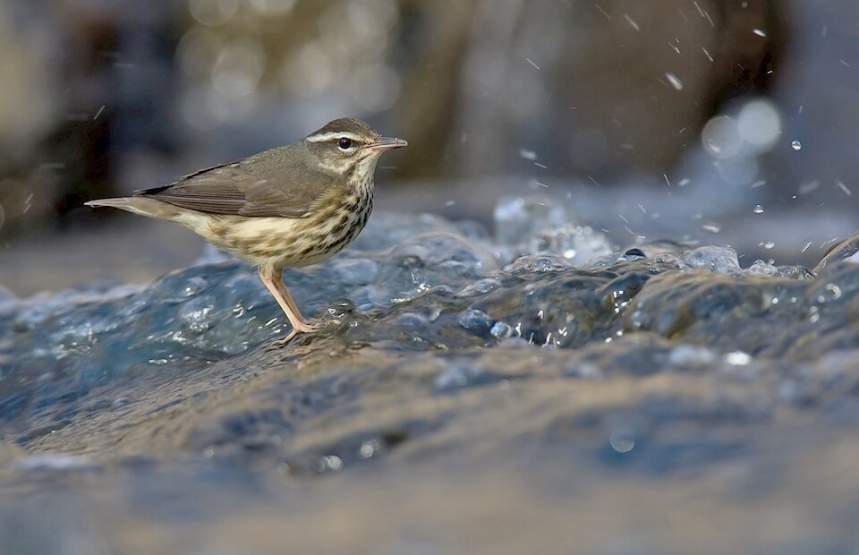

# Louisiana waterthrush

### Seiurus motacilla

<figcaption>Photo: Bill Majoros</figcaption>

### Overall vulnerability:

This species was not assessed for vulnerability.

### Conservation status:

Species of Greatest Conservation Need

## General Information

The Louisiana waterthrush is one of Florida’s rarest and least known breeding birds.  Its range is wide, extending from New Hampshire on the northern end to South America and the West Indies at the southern tip.  Waterthrushes inhabit wooded areas alongside swamps or streams, often constructing their nests in the exposed roots of a fallen tree.  Although insects and spiders form the bulk of this bird’s diet, it makes use of its aquatic habitat to feed on mollusks and fish on occasion. Louisiana waterthrushes are one of the earliest migratory species to arrive in Florida for the spring breeding season – typically nesting beginning in February and leaving for fall migration as early as June.

## Habitat Requirements

**Total habitat within Florida:** 25,971 hectares (modeled)

True to their common name, Louisiana waterthrushes prefer forested wetland or swamp habitat types within the state.

**TODO: habitat crosslinks**

**TODO: habitat map (if exists)**

## Climate Impacts

Louisiana waterthrush populations have declined in recent years, possibly linked to habitat fragmentation.  Fragmentation remains a considerable threat that is likely to be multiplied under climate change.  Other climate-related threats to this species include a reduction in water supply due to changing precipitation patterns and drought, and reduction in prey availability linked to climate-driven shifts in community dynamics.  Unprecedented seasonal temperature variations may trigger migratory behavior changes in breeding bird populations such as the Louisiana waterthrush.  Saltwater encroachment into the freshwater habitats this species prefers is also a concern.

[More information about general climate impacts to species in Florida](/impacts/species).

#### This species is expected to be impacted by sea level rise:

- 3 meters of sea level rise: <1% of habitat (177 ha)
- 1 meter of sea level rise: <1% of habitat (67 ha)

[More information about sea level rise impacts on species in Florida](/impacts/species/slr).
    

## Vulnerability Assessment(s)

This species was not assessed for vulnerability.

## Adaptation Strategies

- Conserving healthy future forested wetland habitat as sea levels rise and human communities begin to shift is important for this species.

- Protecting migratory corridors if forested freshwater wetlands migrate inland in an important adaptation strategy for the Louisiana waterthrush.  Although a significant portion of current habitat is expected to be impacted sea level rise, new areas of suitable habitat may emerge inland if conservation efforts support their natural transition.

[More information about adaptation strategies](/strategies).

## Additional Resources

- [Florida Fish and Wildlife Conservation Commission Species Profile](http://legacy.myfwc.com/bba/docs/bba_LOWA.pdf)
