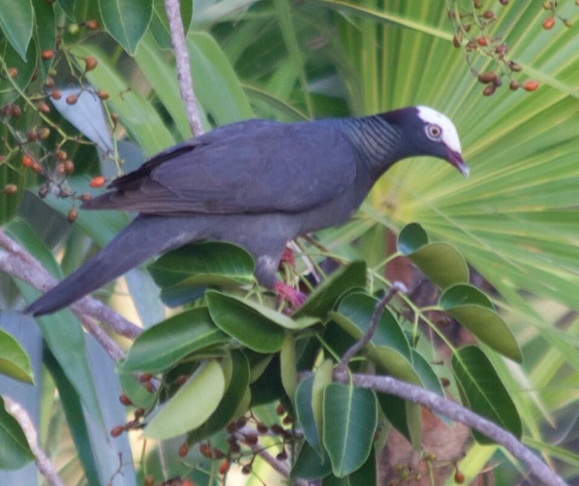

# White-crowned pigeon

### Patagioenas leucocephala

<figcaption>Photo: FWC</figcaption>

### Overall vulnerability:

Low

### Conservation status:

State Threatened

## General Information

This medium-sized perching bird can reach a length of about 14 inches with a wingspan stretching to almost 2 feet.   True to its name, the white-crowned pigeon has a white head framed by green dorsal feathers on the neck and a gray body.  In the United States, this bird occurs only in the coastal tip of south Florida and the Florida Keys.  Internationally, white-crowned pigeon range extends through parts of the Caribbean, Mexico and Central America.  Breeding pairs share most of the duties associated with nesting and rearing chicks and nesting density in an area is dependent on the amount of available food.  These birds primarily eat a diet of tropical hardwood tree fruit.

## Habitat Requirements

**Total habitat within Florida:** 101,485 hectares (modeled)

This species requires low-lying forest habitat types with ample fruiting trees for food.  Rockland hammock and mangrove habitats in south Florida and the Keys can often support breeding white-crowned pigeons.

**TODO: habitat crosslinks**

**TODO: habitat map (if exists)**

## Climate Impacts

The preferred habitat of this species is currently poor and declining within the bird’s range.  Factoring associated with climate change including sea level rise, changing water chemistry, altered land use patterns, increased contamination and pesticides, and fire suppression are very likely to further degrade white-crowned pigeon habitat.  Although pigeons can move to follow their habitat, should some coastal habitat types migrate northward and inland in a changing climate, coastal development is likely to prevent a significant expansion of habitat to new areas.  As habitat quality declines, finding ample food is likely to become a significant limiting factor for the white-crowned pigeon.

[More information about general climate impacts to species in Florida](/impacts/species).

#### This species is expected to be impacted by sea level rise:

- 3 meters of sea level rise: 100% of habitat (101,429 ha)
- 1 meter of sea level rise: 99% of habitat (100,673 ha)

[More information about sea level rise impacts on species in Florida](/impacts/species/slr).
    

## Vulnerability Assessment(s)

The overall vulnerability level (Low) was based on the following assessment(s).
#### 

<h3><a href="/impacts/vulnerability/sivva/species">Standardized Index of Vulnerability and Value Assessment</a></h3>

Moderately vulnerable

 

The primary factors contributing to vulnerability of the white-crowned pigeon are sea level rise, erosion, presence of barriers, alterations to biotic interactions, and synergies with development.

## Adaptation Strategies

- Conserving areas of new potential habitat where mangrove migration will occur is an important adaptation strategy for the white-crowned pigeon.  Relying on current protected habitat that is highly vulnerable to sea level rise, is likely to leave this bird short of an adequate food supply in Florida as climate change accelerates.

- Monitoring natural community shifts to prioritize areas for conservation is an important first step in ensuring ideal white-crowned pigeon habitat can be protected in a future climate.  Since the bird’s preferred habitat is likely to change along with the climate, monitoring can help conservationists get ahead of natural shifts and understand where to best focus their efforts.

[More information about adaptation strategies](/strategies).

## Additional Resources

- [Florida Fish and Wildlife Conservation Commission Species Profile](https://myfwc.com/wildlifehabitats/profiles/birds/white-crowned-pigeon/)
