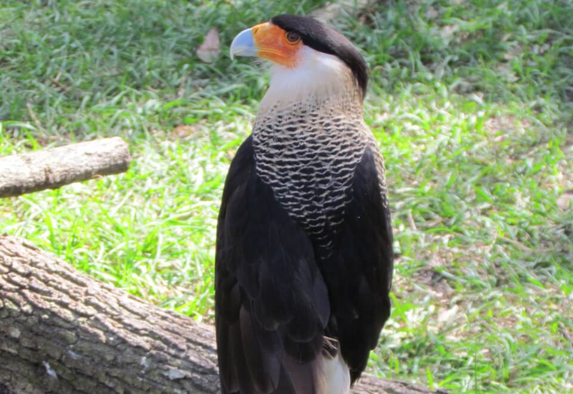

# Audubon’s crested caracara
### *Polyborus plancus audubonii*

<figcaption>Photo: FWC - Shanna Chatraw</figcaption>

**Conservation status:** Federally Threatened

**TODO:vulnerability**

Audubon’s crested caracara is a large raptor with an impressive back crest, red face and pale bluish bill.  Relatively little is known about the life history and reproduction of this species.  Breeding season is thought to peak in the winter and an average clutch size of two eggs can be found in nests built of sticks, dry weed stalks and vine.  The caracara primarily relies on a diet of carrion also preys on small animals including amphibians, reptiles, mammals and other birds.

    
## Habitat Requirements

Audubon’s crested caracara is most often found in the wet prairie habitats of south and central Florida.  The caracara’s ideal habitat features cabbage palms.  The bird also inhabits wooded areas dominated by saw palmetto, scrub oak and cypress.

## Climate Impacts

Audubon’s crested caracara is a relatively isolated species and a habitat specialist, which increases its vulnerability to severe storm events or environmental catastrophes triggered by climate change.  Inland shifting of human developing patterns driven by climate change are likely to greatly exacerbate existing pressures on this species, including habitat destruction and traffic mortality.

## Adaptation Strategies

- Protecting large patches of connected suitable habitat allowing for migration as the climate changes is important given the species’ proclivity for isolation and specific habitat preferences.

- Monitoring natural community shifts may inform conservationist’s ability to identify trends and prioritize key habitat patches in a future climate.

[More information about adaptation strategies](/strategies).

## Additional Resources

- [Multi-Species Recovery Plan for South Florida](https://ecos.fws.gov/docs/recovery_plan/sfl_msrp/SFL_MSRP_Species.pdf)
