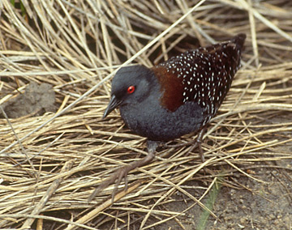

# Black Rail

### Laterallus jamaicensis

<figcaption>Photo: USFWS</figcaption>

### Overall vulnerability:

Low

### Conservation status:

Species of Greatest Conservation Need

## General Information

The black rail is found year-round throughout coastal marshes in Florida.  This small and secretive marsh bird has a soft gray chest and belly and a dark back dabbled with white spots.  The black rail is rarely seen outside of the cover of dense marsh grasses and is also rarely heard – this bird tends only to call late at night.  Black rails eat a diet of spiders, snails and a variety of other aquatic and terrestrial insects.  These birds nest on or near the ground, preferring areas of slight elevation that offer some protection against high tide.

## Habitat Requirements

**Total habitat within Florida:** 177,967 hectares (modeled)

Black rails inhabit tidal marshes along the coast and grassy, freshwater marshes inland.  This species prefers very shallow water or damp soil with scattered pools of water. Black rails require occupy dense stands of spartina and other grasses or sedges that provide thick cover and adequate nesting habitat.

**TODO: habitat crosslinks**

**TODO: habitat map (if exists)**

## Climate Impacts

The black rail is vulnerable to sea level rise directly as well as the increased habitat fragmentation and barriers to migration in coastal areas that are closely linked to rising seas.  As this species is closely associated with specific vegetation compositions within its habitat, shifts in community structure could strain the black rail’s ability to adapt.  The black rail has the advantage of a wide range and the ability of flight, but past and current population decline suggests that this species will not be approaching climate change from an initial point of population resilience, which is likely to increase its struggle to adapt.

[More information about general climate impacts to species in Florida](/impacts/species).

#### This species is expected to be impacted by sea level rise:

- 3 meters of sea level rise: 95% of habitat (169,658 ha)
- 1 meter of sea level rise: 92% of habitat (163,998 ha)

[More information about sea level rise impacts on species in Florida](/impacts/species/slr).
    

## Vulnerability Assessment(s)

The overall vulnerability level (Low) was based on the following assessment(s).
#### 

<h3><a href="/impacts/vulnerability/sivva/species">Standardized Index of Vulnerability and Value Assessment</a></h3>

Slightly vulnerable

 

The primary factors contributing to vulnerability of the black rail are sea level rise, erosion, presence of barriers, habitat fragmentation, runoff and storm surge, and alterations to biotic interactions.

## Adaptation Strategies

- Conserving areas of new potential habitat where marsh migration will occur is likely to be a more appropriate strategy for the black rail than allowing or promoting a shift in community composition within existing habitat.  As black rails are closely associated with specific grass species, they are likely to follow existing habitat compositions rather than adapt to changes.

- Monitoring natural community shifts to prioritize areas for conservation is an important first step in ensuring ideal black rail habitat can be conserved in a future climate.  Since the bird’s preferred habitat type may shift northward for plants to be successful as climate change accelerates, monitoring can help conservationists get ahead of natural shifts and understand where to best focus their efforts.

[More information about adaptation strategies](/strategies).

## Additional Resources

- [Florida Fish and Wildlife Conservation Commission Species Profile](http://legacy.myfwc.com/bba/docs/bba_blra.pdf)
