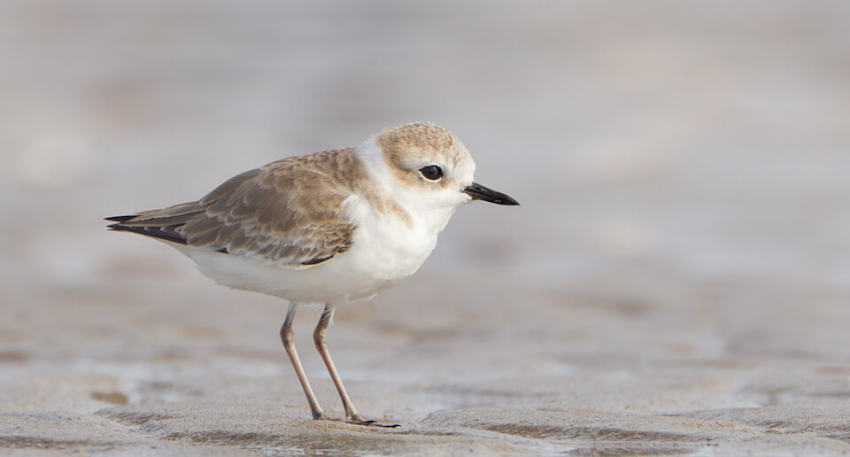

# Cuban snowy plover
### *Charadrius nivosus tenuirostris*

**Conservation status:** Species of Greatest Conservation Need

**TODO:vulnerability**

This small, white and grey shorebird is one of two recognized North American subspecies of the snowy plover.  This bird is a permanent resident of the gulf coast, including Alabama and parts of the Florida panhandle.  Cuban snowy plovers forage along the shoreline for soft invertebrates and insects.  Plover chicks are resilient and are fully capable of leaving the nest, swimming, running and foraging almost immediately after hatching.

    
## Habitat Requirements

Cuban snowy plovers prefer the open beach and dune grass habitats of the Gulf coast.  They require sparse vegetation to nest successfully.

## Climate Impacts

As a beach nesting species, the Cuban snowy plover is extremely vulnerable to many threats that are common in coastal areas including habitat inundation from sea level rise.  Cuban snowy plover nests on the open beach are easily destroyed by extreme weather events, human disturbance and predation, all of which are likely to increase as climate change accelerates.  Given the hazardous conditions to which they are accustomed, it is not uncommon for these birds to start over with new nests up to six times per season.  However, an especially bad year or a severe storm event late in the season can destroy plover clutches for the year, negatively impacting the bird’s already small population.  Habitat fragmentation stemming from changes in coastal development patterns linked to climate change is also likely to be a concern for this species.

## Adaptation Strategies

- Conservation of existing beach habitat will allow the Cuban snowy plover the best chance of increasing and maintaining a healthy population on the Gulf coast as climate change begins to accelerate.  This includes controlling existing stressors, such predation from non-native species and coastal development and traffic.

- Conserving healthy future coastal habitat as sea levels rise and human communities begin to shift is important for this species.

- Assisted migration or facilitation of inland movement is a possible long-term adaptation strategy for the Cuban snowy plover.  Elsewhere in North America, these birds have established a small number of successful inland nesting colonies.

[More information about adaptation strategies](/strategies).

## Additional Resources

- [FWC Imperiled Species Management Plan (ISMP)](http://myfwc.com/media/4133167/Floridas-Imperiled-Species-Management-Plan-2016-2026.pdf)

- [FWC Biological Status Review](http://www.myfwc.com/media/2273403/Snowy-Plover-BSR.pdf)

- [FWC Species Action Plan](http://myfwc.com/media/2720106/Imperiled-Beach-Nesting-Birds-Species-Action-Plan-Final-Draft.pdf)
