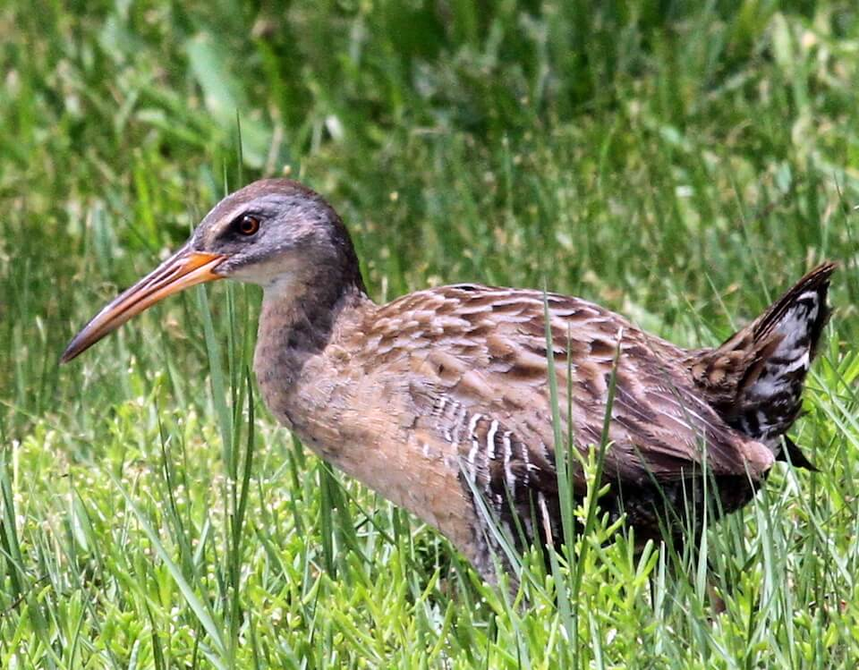

# Clapper rail

### Rallus longirostris

<figcaption><a href="https://commons.wikimedia.org/w/index.php?curid=52848271" target="_blank" rel="noopener noreferrer">Photo: Greg Schechter</a></figcaption>

### Overall vulnerability:

High

### Conservation status:

Species of Greatest Conservation Need

## General Information

Especially abundant along the marshy coastline of Florida’s Big Bend region, the clapper rail is a year-round resident of coastal Florida.  Outside of the state, clapper rails reside and breed along both coasts of North America.  Clapper rails are highly secretive birds, typically remaining hidden among the grasses of the high tidal marshes where they nest. During periods of low tide, rails venture from their cover to forage for insects, crabs and mollusks along the exposed mudflats.  While seldom seen, clapper rails are often heard.  Their loud call, a harsh “kek-kek-kek” note, often elicits a clattering chorus of responses.

## Habitat Requirements

Clapper rails nest in the higher portions of tidal salt marshes or tall cordgrass that blocks inundation from high tide.

**TODO: habitat crosslinks**

**TODO: habitat map (if exists)**

## Climate Impacts

While clapper rail populations are abundant, the bird is considered highly vulnerable to climate-related threats, most notably sea level rise.  Estimates indicate that the clapper rail could lose up to 100% of usable habitat to sea level rise.  Manmade and natural barriers, such as development, may prevent the clapper rail from extending its range into new areas of suitable habitat under climate change.  Additionally, the clapper rail is highly dependent on available fiddler crab, with other prey only supplementing the bird’s diet.  This degree of specialty may limit the clapper rail’s ability to adapt to new sources of food in shifting ecological communities due to climate change.

[More information about general climate impacts to species in Florida](/impacts/species).

## Vulnerability Assessment(s)

The overall vulnerability level (High) was based on the following assessment(s).
#### 

<h3><a href="/impacts/vulnerability/ccvi">Climate Change Vulnerability Index</a></h3>

Highly vulnerable

 

The clapper rail is highly vulnerable to climate change, particularly sea level rise.  It is estimated that 100% of the species' current range is expected to be impacted by a 1-meter sea level rise.  However, intertidal habitat is expected to increase in extent with sea level rise.  Natural topographic barriers on the east coast of Florida would limit the ability of the habitat to migrate inland, while the more gentle slope  along the Gulf coast would facilitate inland migration of habitat.  Approximately 90% of the range boundary could be impacted by anthropogenic barriers preventing interior shifts of the habitat.  An increase in the frequency of early season tropical storms could negatively impact the species by disrupting nesting, flooding nests and/or drowning fledglings.

#### 

<h3><a href="/impacts/vulnerability/gcva">Gulf Coast Vulnerability Assessment</a></h3>

Moderately to Highly vulnerable

 

Vulnerability ranged from moderate levels throughout most of the Gulf coast of Florida, to high in extreme south Florida.  Marsh fragmentation may negatively affect clapper rail’s dispersive potential and population connectivity.  Increased hurricane frequency and the associated storm surge pose a threat to this species.  Nest located in the low salt marsh vegetation are easily flooded.  Potential changes in biotic interactions may negatively impact the clapper rail, including increased encounters with predators, decreased prey (fiddler crab) availability, and increased encounters with humans.

## Adaptation Strategies

- Conserving healthy future marsh habitat as sea levels rise and human communities begin to shift is important for this species.

- Protecting migratory corridors if marsh and mangrove habitats migrate inland is an important adaptation strategy for the clapper rail.  Although a significant portion of current habitat is expected to be impacted sea level rise, new areas of suitable habitat may emerge inland if conservation efforts support their natural transition.

- Restoring high elevation marsh areas, including following a major storm or disturbance event, is an important aspect of protecting clapper rail nesting habitat.

[More information about adaptation strategies](/strategies).

## Additional Resources

- [Florida Fish and Wildlife Conservation Commission Species Profile](http://legacy.myfwc.com/bba/docs/bba_clra.pdf)
