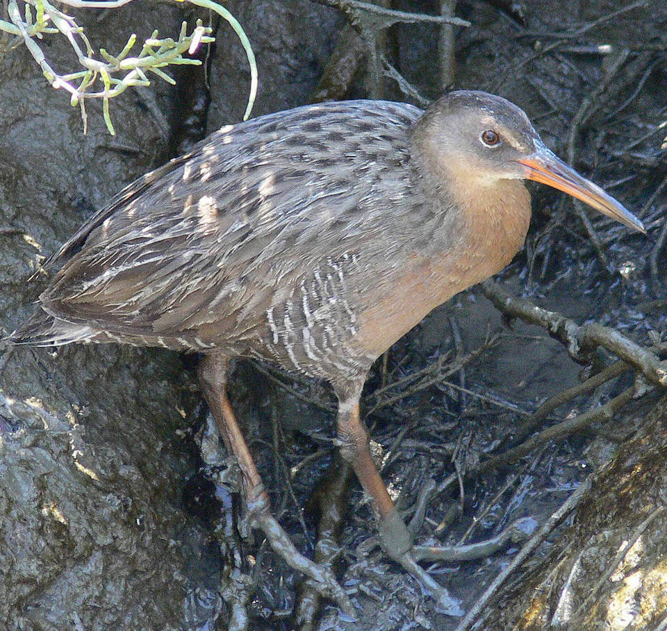

# Mangrove clapper rail

### Rallus longirostris insularum

<figcaption>Photo: USFWS</figcaption>

### Conservation status:

Species of Greatest Conservation Need

### Overall vulnerability:

High

A subspecies of the clapper rail found only in the Florida Keys, the mangrove clapper rails are genetically distinct from clapper rail population found elsewhere in the state.  Mangrove clapper rails are highly secretive birds, typically remaining hidden among the grasses of the high tidal marshes where they nest. During periods of low tide, rails venture from their cover to forage for insects, crabs and mollusks along the exposed mudflats.  While seldom seen, clapper rails are often heard.  Their loud call, a harsh “kek-kek-kek” note, often elicits a clattering chorus of responses.

## Habitat Requirements

Mangrove clapper rails nest in the higher portions of tidal salt marshes or tall cordgrass that blocks inundation from high tide.

**TODO: habitat crosslinks**

**TODO: habitat map (if exists)**

## Climate Impacts

The mangrove clapper rail is considered highly vulnerable to climate-related threats, most notably sea level rise.  Estimates indicate that the clapper rail could lose up to 100% of usable habitat to sea level rise.  Manmade and natural barriers, such as development, may prevent the mangrove clapper rail from extending its range into new areas of suitable habitat under climate change.  Additionally, the mangrove clapper rail is highly dependent on available fiddler crab, with other prey only supplementing the bird’s diet.  This degree of specialty may limit this bird’s ability to adapt to new sources of food in shifting ecological communities due to climate change.  As a subspecies, the mangrove clapper rail is also at risk of genetic swamping if it moves and interbreeds with mainland populations under the shifting conditions of climate change.

[More information about general climate impacts to species in Florida](/impacts/species).

## Vulnerability Assessment(s)

The overall vulnerability level (High) was based on the following assessment(s).
#### 

<h3><a href="/impacts/vulnerability/sivva/species">Standardized Index of Vulnerability and Value Assessment</a></h3>
<b class="high">Highly vulnerable</b>

 

The primary factors contributing to vulnerability of the mangrove clapper rail are sea level rise, erosion, presence of barriers, changes in temperature regime, habitat fragmentation, changes in salinity, and runoff and storm surge.

## Adaptation Strategies

- Conserving healthy future habitat in the Florida Keys as sea levels rise and human communities begin to shift is important for this species.

- Restoring high elevation marsh areas, including following a major storm or disturbance event, is an important aspect of protecting mangrove clapper rail nesting habitat.

- If preserving the genetic integrity of this subspecies is a priority, assisted migration to an isolated location where mangrove clapper rails are likely to remain separate from other clapper rail populations may be considered.

[More information about adaptation strategies](/strategies).

## Additional Resources

- [Other Species Profile](https://www.allaboutbirds.org/guide/Clapper_Rail/overview)
