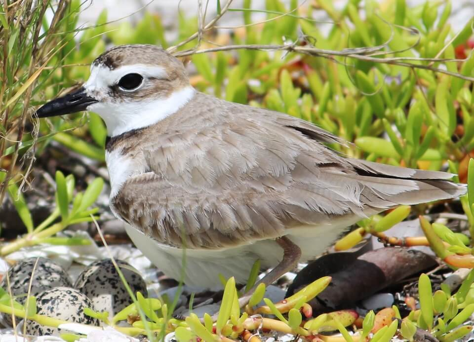

# Wilson’s plover

### Charadrius wilsonia

<figcaption>Photo: FWC</figcaption>

### Overall vulnerability:

Moderate

### Conservation status:

Species of Greatest Conservation Need

## General Information

Wilson’s plovers are medium-sized shorebirds, larger than snowy plovers but smaller than killdeers. This bird is found throughout coastal areas in Florida, with breeding populations common in the north part of the state and overwintering birds typically found in the southern peninsula.  The bird’s global range is wide – including much of both North American coasts, the Caribbean and South and Central America. During the spring breeding season, males will perform their courtship rituals before constructing a nest with their mates. The nests are constructed in the bare sand. This bird’s offspring are independent and begin to forage with their parents shortly after hatching.

## Habitat Requirements

Wilson’s plovers inhabit beach and surf zones along the coasts.

**TODO: habitat crosslinks**

**TODO: habitat map (if exists)**

## Climate Impacts

Changing weather patterns and more extreme temperatures can affect Wilson’s plover migratory patterns. In addition to climatic threats, interaction with human developments and populations can increase the rates of disturbed nests and offspring mortality. Development of coastal areas decreases available habitat for this species in Florida.

[More information about general climate impacts to species in Florida](/impacts/species).

## Vulnerability Assessment(s)

The overall vulnerability level (Moderate) was based on the following assessment(s).
#### 

<h3><a href="/impacts/vulnerability/sivva/species">Standardized Index of Vulnerability and Value Assessment</a></h3>

Moderately vulnerable

 

The primary factors contributing to vulnerability of the Wilson's plover are sea level rise, erosion, presence of barriers, minimal habitat protection, habitat fragmentation, runoff and storm surge, and synergies with development.

#### 

<h3><a href="/impacts/vulnerability/gcva">Gulf Coast Vulnerability Assessment</a></h3>

Highly vulnerable

 

The vulnerability of Wilson's plover was identified as high in Florida.  The primary factors impacting this species include sea level rise, runoff and storm surge, and alterations to natural disturbance regimes.  Increased temperatures may add stress to eggs and chicks.

## Adaptation Strategies

- Restoration and protection of existing coastal habitat is important for Wilson’s plovers.  As climate change begins to accelerate, protecting areas of future habitat allowing for natural coastal migration not impeded by human development may benefit this species.

- Identifying and restricting human access at known nesting locations is a no-regrets strategy likely to bolster population resilience at the onset of intensifying climate change.

- Controlling nonnative predators such as rat and feral cat populations is likely to benefit this species under the increasing stress of climate change.

[More information about adaptation strategies](/strategies).

## Additional Resources

- [Florida Fish and Wildlife Conservation Commission Species Profile](http://legacy.myfwc.com/bba/docs/bba_WIPL.pdf)
