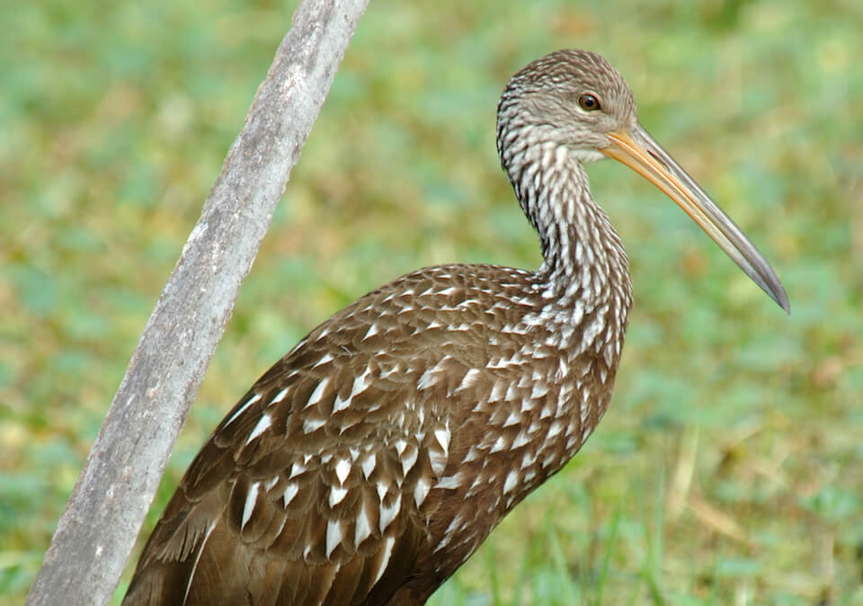

# Limpkin

### Aramus guarauna

<figcaption>Photo: FWC - Mike Baranski</figcaption>

### Overall vulnerability:

Moderate

### Conservation status:

Species of Greatest Conservation Need

## General Information

This long-legged water bird has dark brown feathers with bright white streaks on its head and neck.  The bird is known for its resoundingly loud and high-pitched call Limpkins have a unique bill with a downward curve expertly developed for feeding on apple snails.  In addition to their food of choice, limpkins feed on worms, insects and mussel.  Limpkins nest in the winter and early spring following an elaborate and tender courtship ritual where the male feeds the female in imitation of an adult feeding a juvenile.  The limpkin’s range only extends to Florida in the United States but the bird is also found in South and Central American and the Caribbean.  Within Florida, the species is widespread throughout the peninsula but rarer in the panhandle and the keys.

## Habitat Requirements

**Total habitat within Florida:** 818,730 hectares (modeled)

Limpkins inhabit a variety of habitat types in Florida, including the shallows along rivers, lakes, marshes, glades and swamps.

**TODO: habitat crosslinks**

**TODO: habitat map (if exists)**

## Climate Impacts

The limpkin’s historical population was decimated by overhunting.  While conservation efforts have helped the species recover in Florida, habitat loss and fragmentation and decline of the apple snail, the bird’s primary prey item, remain significant threats.  These existing threats are likely to be magnified by changing conditions under climate change.  The freshwater shallows the limpkin relies upon are highly vulnerable to sea level rise and salt water encroachment.  As a predator closely linked to its prey of choice, the limpkin is not as likely to successfully adapt to changing conditions as a species with more generalist tendencies.

[More information about general climate impacts to species in Florida](/impacts/species).

#### This species is expected to be impacted by sea level rise:

- 3 meters of sea level rise: 24% of habitat (194,380 ha)
- 1 meter of sea level rise: 15% of habitat (122,932 ha)
    

## Vulnerability Assessment(s)

The overall vulnerability level (Moderate) was based on the following assessment(s).
#### 

<h3><a href="/impacts/vulnerability/ccvi">Climate Change Vulnerability Index</a></h3>

Moderately vulnerable

 

The major factors contributing to the limpkin's vulnerability include dependence on a particular hydrologic regime, a narrow diet breadth, and potentially incompatible human responses to climate change.  Approximately 15% of the species' range is expected to be inundated under a 1-meter sea level rise.  More frequent, severe, or prolonged flooding could potentially impact the limpkin - temporarily suspending prey availability, reducing prey numbers, or destroying limpkin nests.  However, increased floods could provide a benefit through flooding of previously dry areas and recolonization of those sites with aquatic prey.

## Adaptation Strategies

- Conserving areas of new potential habitat where freshwater marsh and floodplain migration may occur is likely to be a more appropriate strategy for the limpkin than allowing or promoting a shift in community composition within existing habitat.   While specific changes in precipitation patterns under climate change are difficult to predict, some areas in the state are expected to become wetter while others will become drier and more prone to drought.  As climate change accelerates, Florida limpkins may need to follow these precipitation shifts, moving away from areas of current habitat that will become drier.

- Monitoring natural community shifts to prioritize areas for conservation is an important first step in ensuring limpkin habitat can be conserved in a future climate.  As locations of prime limpkin habitat are likely to shift under climate change, monitoring can help conservationists get ahead of natural shifts and understand where to best focus their efforts.  This strategy is also important to mitigate extensive habitat loss from altered human land use patterns in a changing climate.

[More information about adaptation strategies](/strategies).

## Additional Resources

- [Florida Fish and Wildlife Conservation Commission Species Profile](https://myfwc.com/wildlifehabitats/profiles/birds/waterbirds/limpkin/)
