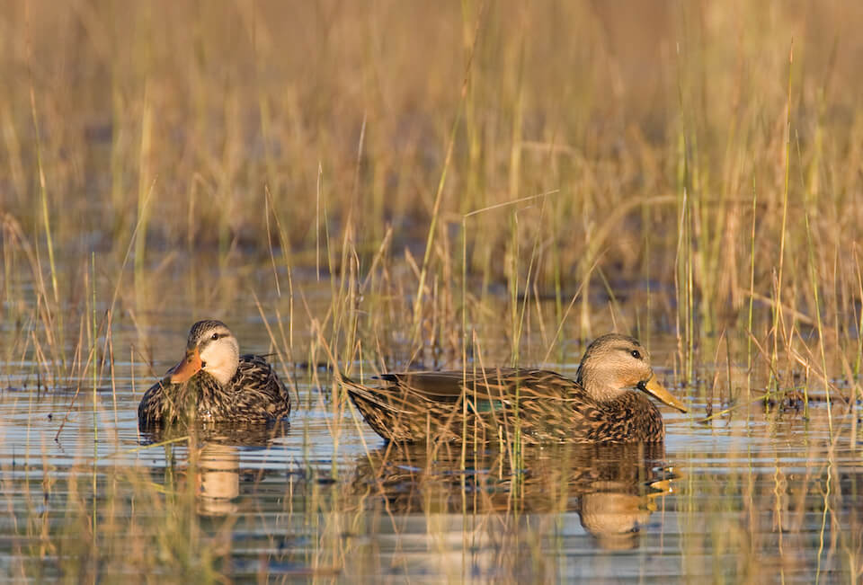

# Mottled duck

### Anas fulvigula fulvigula

<figcaption>Photo: FWC - Ron Bielefeld</figcaption>

### Overall vulnerability:

Moderate

### Conservation status:

Species of Greatest Conservation Need

## General Information

The mottled duck, also commonly known as the Florida mallard, is a member of a worldwide suite of closely related ducks known as the mallard complex.  The Florida mottled duck is one of few non-migratory ducks in North America and is unique to peninsular Florida.  The mottled duck is similar in appearance to a mallard but can be distinguished by its brown head, rather than the characteristic iridescent green of a mallard.  This species is omnivorous and eats a varied diet of insects, mollusks, small fish and plant matter.  Females locate their nests within patches of dense vegetation during the early spring months and bring their new ducklings to water only 48 hours after hatching.

## Habitat Requirements

**Total habitat within Florida:** 2,532,232 hectares (modeled)

Mottled ducks inhabit a variety of freshwater and brackish habitats in the state including marshes, ponds, canals, ditches, and mosquito impoundments.

**TODO: habitat crosslinks**

**TODO: habitat map (if exists)**

## Climate Impacts

Habitat loss and fragmentation are current threats for the mottled duck that are likely to intensify under climate change.  Changes to the hydrological cycle, precipitation patterns, predator prey dynamics, salination and water chemistry are all likely to impact mottled duck habitat in the state.  Many of the freshwater habitats favored by the mottled duck are highly vulnerable to sea level rise and salt water encroachment.

[More information about general climate impacts to species in Florida](/impacts/species).

#### This species is expected to be impacted by sea level rise:

- 3 meters of sea level rise: 22% of habitat (556,056 ha)
- 1 meter of sea level rise: 6% of habitat (147,141 ha)

[More information about sea level rise impacts on species in Florida](/impacts/species/slr).
    

## Vulnerability Assessment(s)

The overall vulnerability level (Moderate) was based on the following assessment(s).
#### 

<h3><a href="/impacts/vulnerability/gcva">Gulf Coast Vulnerability Assessment</a></h3>

Moderately vulnerable

 

Vulnerability for the mottled duck was found to be moderate throughout its' range across the Gulf states (Texas thru Florida).  Coastal marshes may become unsuitable as sea level rises; however, Florida's population of the mottled duck is mostly supported by freshwater emergent habitats so coastal habitat changes may only have a minimal impact.  Changes in precipitation could affect this species, impacting the availability of suitable freshwater wetlands.  The mottled duck's ability to adapt to a variety of habitats will increase their ability to adapt to changes.  Human relocation from coastal areas to inland may have negative impacts on freshwater wetlands, including development, pollution and water usage.  An issue already occurring in Florida, hybridization with domestic mallards, may be exacerbated by impacts from climate change.

## Adaptation Strategies

- Conserving areas of new potential habitat where freshwater marsh and floodplain migration may occur is likely to be a more appropriate strategy for the mottled duck than allowing or promoting a shift in community composition within existing habitat.   While specific changes in precipitation patterns under climate change are difficult to predict, some areas in the state are expected to become wetter while others will become drier and more prone to drought.  As climate change accelerates, mottled ducks may need to follow these precipitation shifts to find adequate wetland habitat, moving away from areas of current habitat that will become drier.

- Monitoring natural community shifts to prioritize areas for conservation is an important first step in ensuring duck habitat can be conserved in a future climate.  As locations of prime duck habitat are likely to shift under climate change, monitoring can help conservationists get ahead of natural shifts and understand where to best focus their efforts.  This strategy is also important to mitigate extensive habitat loss from altered human land use patterns in a changing climate.

[More information about adaptation strategies](/strategies).

## Additional Resources

- [Florida Fish and Wildlife Conservation Commission Species Profile](https://myfwc.com/wildlifehabitats/profiles/birds/waterfowl/mottled-ducks/)
