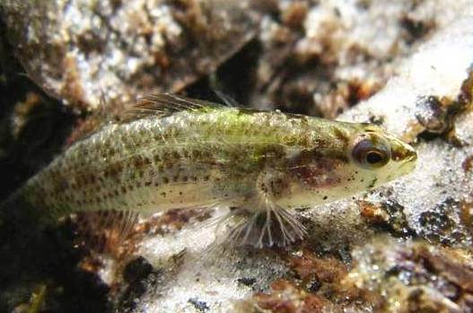

<content-header icon="freshwater_fish" title="Okaloosa darter" subtitle="Etheostoma okaloosae">
</content-header>

<figcaption>Photo: Bill Tate, USFWS</figcaption>

### Overall vulnerability:

High

### Conservation status:

Federally Threatened

## General Information

This small green and yellow darter inhabits a tiny geographic range almost entirely confined to the grounds of Elgin Airforce Base in the Florida panhandle.  Darters are benthic fish named for their tendency to move between spots in short bursts of motion.  In between “darts” of movement they remain very still.  Darters lack a swim bladder, allowing them to control their buoyancy.    Okaloosa darters breed during the summer months with two peak breeding periods in April and October. The Okaloosa darter’s diet typically consists of mayfly nymphs and caddisfly larvae.

## Habitat Requirements

Okaloosa darters inhabit small streams, fed by groundwater seepage from the surrounding sandhills. This species is highly sensitive to water quality and flow levels within its narrow range.

**TODO: habitat crosslinks**

## Climate Impacts

The Okaloosa darter occupies a very small geographic range, making it particularly vulnerable to changes in its surrounding habitat. This darter is sensitive to water quality in its habitat, leaving it vulnerable to increased sedimentation and pollution and changes in temperature, water chemistry and flow levels linked to climate change.  As many species begin to shift their ranges in response to climate change, Okaloosa darters may be threatened by the increased presence of invasive species or hybridization with other species of darters.  The brown darter is its largest current threat – easily outcompeting Okaloosa darters for food and resources.

[More information about general climate impacts to species in Florida](/impacts/species).

## Vulnerability Assessment(s)

The overall vulnerability level (High) was based on the following assessment(s).
#### 

<h3><a href="/impacts/vulnerability/sivva/species">Standardized Index of Vulnerability and Value Assessment</a></h3>

Highly vulnerable

 

The primary factor contributing to vulnerability of the Okaloosa darter is the presence of barriers.

## Adaptation Strategies

- Prioritize key stream systems that are less vulnerable to climate change.   As this species is dependent on high water quality, focusing restoration and conservation efforts on the sites with the with the highest likelihood of resilience in a future climate may be an effective strategy.

[More information about adaptation strategies](/strategies).

## Additional Resources

- [Florida Fish and Wildlife Conservation Commission Species Profile](https://myfwc.com/wildlifehabitats/profiles/freshwater/okaloosa-darter/)

- [Federal Recovery Plan](https://ecos.fws.gov/docs/recovery_plan/970407.pdf)
