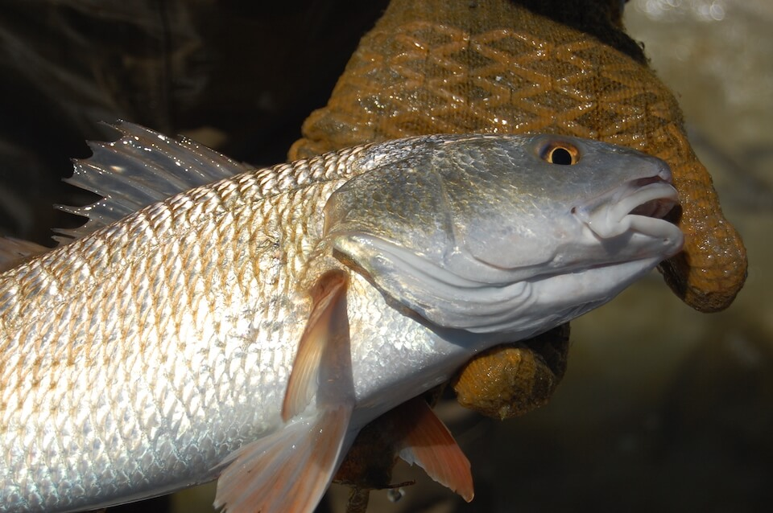

<content-header icon="marine_fish" title="Red drum" subtitle="Sciaenops ocellatus">
</content-header>

<figcaption>Photo: FWC</figcaption>

### Overall vulnerability:

Low

### Conservation status:

Not Listed

## General Information

Also known as redfish or red bass, red drums are one of Florida’s most popular sport fish.  Their name comes from the drumming sound they make during spawning and when removed from the water, produced by muscles rubbing against their inflated swim bladder.  These large fish can reach lengths of 45 inches and weigh up to 50 pounds.  Their range is similarly impressive – they inhabit nearshore and offshore waters of the Gulf of Mexico and the Atlantic from Massachusetts to Key West.

## Habitat Requirements

Nearshore and offshore waters throughout the Gulf of Mexico and the Atlantic Oceans.

**TODO: habitat crosslinks**

## Climate Impacts

As a species with a wide range and a robust population, red drums have mobility on their side as they begin to adapt to a changing climate.  Like all marine species however, they have the potential to be impacted by changing conditions in the ocean in the face of climate change, including warming sea temperatures and acidification.  Even if drums are able to successfully respond to these changes, they may be impacted by decreases in prey availability in various locations throughout their range.  The most substantial climate-related impacts to red drums will occur in estuarine and marsh habitat, which is important for larval and juvenile fish.  Sea level rise and coastal erosion could negatively impact this habitat.

[More information about general climate impacts to species in Florida](/impacts/species).

## Vulnerability Assessment(s)

The overall vulnerability level (Low) was based on the following assessment(s).
#### 

<h3><a href="/impacts/vulnerability/gcva">Gulf Coast Vulnerability Assessment</a></h3>

Low to Moderately vulnerable

 

The vulnerability of red drum in the Gulf region of Florida ranges from low (south Florida to Cedar Key) to moderate (big bend region and panhandle).  Most of the impacts from climate change will occur in the estuaries where larval and juvenile red drum use sea grass beds and marsh edges.  Loss of marsh and sea grass beds due to sea level rise and erosion could negatively impact red drum.

## Adaptation Strategies

- Monitoring and managing fish stocks in consideration of changing and future conditions is important for this sport fish.

- Conservation and restoration of existing marsh habitat including nature-based shoreline protection methods is important to increase habitat and species health and resilience at the onset of intensifying climate change.

[More information about adaptation strategies](/strategies).

## Additional Resources

- [Florida Fish and Wildlife Conservation Commission Species Profile](https://myfwc.com/wildlifehabitats/profiles/saltwater/drums/red-drum/)
