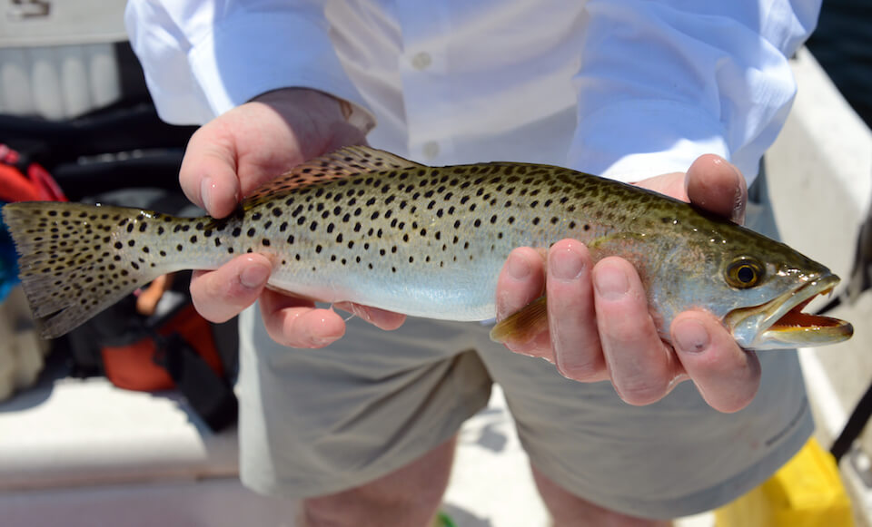

<content-header icon="marine_fish" title="Spotted seatrout" subtitle="Cynoscion nebulosus"></content-header>

<figcaption>Photo: FWC</figcaption>

### Overall vulnerability:

Low

### Conservation status:

Not Listed

## General Information

Spotted seatrout are managed for both commercial and recreational fishing in Florida.  Seatrout are a common estuarine species throughout the waters of the Gulf of Mexico and the Atlantic from Florida to Maryland.  Despite its common name, this fish is a member of the drum family rather than the trout family and makes the characteristic drumming sound common to that group of fishes during spawning.  Spotted seatrout are golden in color with speckled sides.  Their diet consists of crustaceans and fish once trout grow large enough to capture larger prey.

## Habitat Requirements

Spotted seatrout inhabit the top of the water column of inshore waters.  They are most often caught around grassy flats and are known to seek refuge in coastal rivers during colder periods.

**TODO: habitat crosslinks**

## Climate Impacts

As a species with a wide range and a robust population, spotted seatrout have mobility on their side as they begin to adapt to a changing climate.  Like all marine species however, they have the potential to be impacted by changing conditions in the ocean in the face of climate change, including warming sea temperatures and acidification.  Even if seatrout successfully respond to these changes, they may be impacted by decreases in prey availability in various locations throughout their range.  The most substantial climate-related impacts to seatrout will occur in estuarine habitat, which is important for this species.  Sea level rise and coastal erosion in addition to extreme temperature shifts could negatively impact seatrout in estuarine habitats.

[More information about general climate impacts to species in Florida](/impacts/species).

## Vulnerability Assessment(s)

The overall vulnerability level (Low) was based on the following assessment(s).
#### 

<h3><a href="/impacts/vulnerability/gcva">Gulf Coast Vulnerability Assessment</a></h3>

Low to Moderately vulnerable

 

The spotted seatrout's vulnerability was assessed by its' association with tidal emergent marsh.  Seatrout also use submerged aquatic vegetation and open water as habitat, both of which may increase as a result of sea level rise.  Increased temperatures my impact reproductive success if water temperatures exceed the threshold for egg and larval survival.

## Adaptation Strategies

- Monitoring and managing fish stocks in consideration of changing and future conditions is important for this sport fish.

- Conservation and restoration of existing habitat including nature-based shoreline protection methods is important to increase habitat and species health and resilience at the onset of intensifying climate change.

[More information about adaptation strategies](/strategies).

## Additional Resources

- [Florida Fish and Wildlife Conservation Commission Species Profile](https://myfwc.com/wildlifehabitats/profiles/saltwater/drums/spotted-seatrout/)
