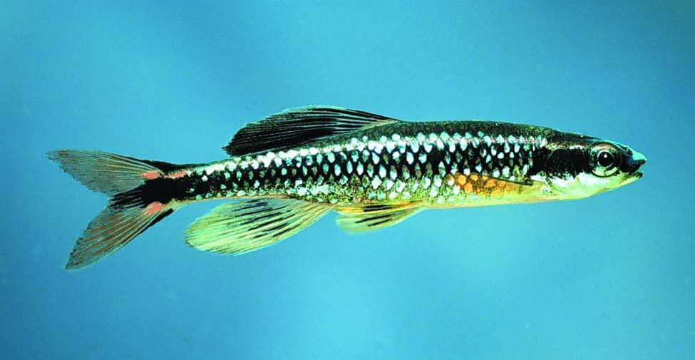

<content-header icon="freshwater_fish" title="Bluenose shiner" subtitle="Pteronotropis welaka"></content-header>

<figcaption>Photo: FWC</figcaption>

### Overall vulnerability:

This species was not assessed for vulnerability.

### Conservation status:

State Threatened

## General Information

The bluenose shiner is a smaller member of its family.  This fish is slender and olive-colored, with a distinct blue nose.  Bluenose shiners breed during the spring and summer and these fish rely on a diet of insects. This species occupies two distinct ranges within Florida – one in the St. Johns River basin and the other in the western reaches of the panhandle with no known exchange between the two.

## Habitat Requirements

Bluenose shiners prefer backwaters and river swamp habitats with thick aquatic vegetation and deep pools.

**TODO: habitat crosslinks**

## Climate Impacts

Due to their small geographic range and distinct, isolated populations, bluenose shiners are especially vulnerable to habitat loss. Their limited habitat is surrounded by heavily populated areas, resulting in negative impacts from pollution and human activity that are likely to worsen as climate change accelerates.  Changes in hydrological cycles including drought and flood events, and increased frequency of strong storms is also a concern for this species.  This threat is also magnified by the fish’s small range –  one or two seasons of intense drought or one extreme disturbance event could result in local extirpation.

[More information about general climate impacts to species in Florida](/impacts/species).

## Vulnerability Assessment(s)

This species was not assessed for vulnerability.

## Adaptation Strategies

- Developing sampling programs to gather information on the distribution of this species may inform management decisions in an uncertain future.

- Prioritize key habitat areas that are used by the fish and are less vulnerable to climate change.   As this species is dependent on water quality and temperature, focusing restoration and conservation efforts on the sites with the with the highest likelihood of resilience in a future climate may be an effective strategy.

[More information about adaptation strategies](/strategies).

## Additional Resources

- [Florida Fish and Wildlife Conservation Commission Species Profile](https://myfwc.com/wildlifehabitats/profiles/freshwater/bluenose-shiner/)
