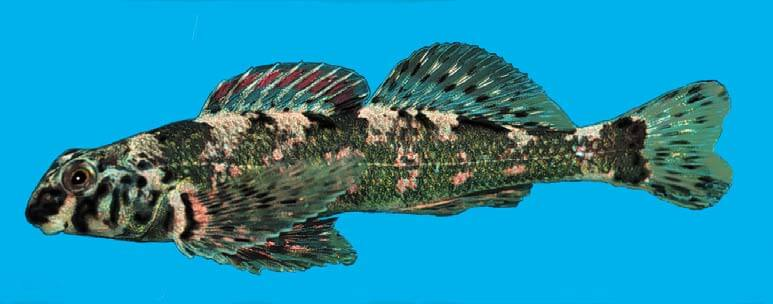

<content-header icon="freshwater_fish" title="Harlequin darter" subtitle="Etheostoma histrio"></content-header>

<figcaption>Photo: FWC</figcaption>

### Overall vulnerability:

This species was not assessed for vulnerability.

### Conservation status:

State Species of Special Concern

## General Information

This colorful darter is green with bright, multi-colored splotches and stripes on the fins and body.  Darters are benthic fish named for their tendency to move between spots in short bursts of motion.  In between “darts” of movement they remain very still.  Darters lack a swim bladder, allowing them to control their buoyancy.  Harlequin darters occur only in the Escambia River watershed in Florida but outside of the state they can be found in parts of Texas, Kentucky and the Midwest.

## Habitat Requirements

Harlequin darters rely on snags, or dead trees and debris build-up in rivers and creeks for shelter and spawning.  This species is highly sensitive to water quality and flow levels within its range.

**TODO: habitat crosslinks**

## Climate Impacts

The harlequin darter occupies a very small geographic range in Florida, making it particularly vulnerable to changes in its surrounding habitat including insolated disturbance events. This darter is sensitive to water quality in its habitat, leaving it vulnerable to increased sedimentation and pollution and changes in temperature, water chemistry and flow levels linked to climate change.  As many species begin to shift their ranges in response to climate change, harlequin darters may be threatened by the increased presence of invasive species or hybridization with other species of darters.

[More information about general climate impacts to species in Florida](/impacts/species).

## Vulnerability Assessment(s)

This species was not assessed for vulnerability.

## Adaptation Strategies

- Prioritize key stream systems that are less vulnerable to climate change.   As this species is dependent on high water quality, focusing restoration and conservation efforts on the sites with the with the highest likelihood of resilience in a future climate may be an effective strategy.

[More information about adaptation strategies](/strategies).

## Additional Resources

- [Florida Fish and Wildlife Conservation Commission Species Profile](https://myfwc.com/wildlifehabitats/profiles/freshwater/harlequin-darter/)
