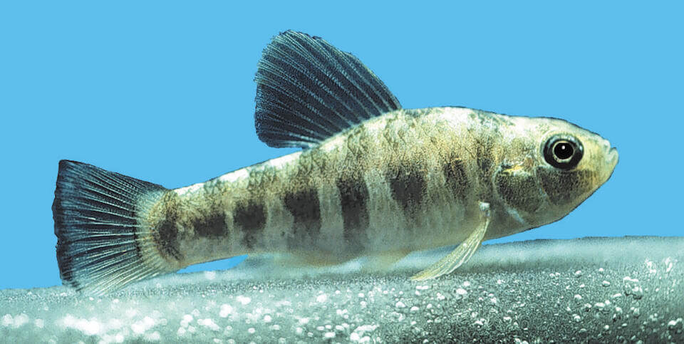

<content-header icon="freshwater_fish" title="Lake Eustis pupfish" subtitle="Cyprinodon variegatus hubbsi">
</content-header>

<figcaption>Photo: FWC</figcaption>

### Overall vulnerability:

This species was not assessed for vulnerability.

### Conservation status:

Species of Greatest Conservation Need

## General Information

The Lake Eustis pupfish is a small brown fish with dark vertical stripes that measures approximately three inches in length. This species feeds primarily on insect larvae and small crustaceans. Male pupfish will create nests by digging small depressions in the sand and defending it from other males while courting approaching females.  Females will spawn throughout year.

## Habitat Requirements

The Lake Eustis pupfish is endemic to central Florida, inhabiting about eight lakes in Orange, Lake, and Marion counties. These fish prefer sandy beaches with intense wave action and very little vegetation.

## Climate Impacts

Due to their small geographic range, Lake Eustis pupfish are especially vulnerable to habitat loss. Their limited habitat is surrounded by heavily populated areas, resulting in negative impacts from pollution and human activity that are likely to worsen as climate change accelerates.  Increasing impacts from invasive plant and animal species is also likely to be a substantial concern for this species under climate change.

[More information about general climate impacts to species in Florida](/impacts/species).

## Vulnerability Assessment(s)

This species was not assessed for vulnerability.

## Adaptation Strategies

- Developing sampling programs to gather information on the distribution of this species may inform management decisions in an uncertain future.

- Prioritize key habitat areas that are used by the fish and are less vulnerable to climate change.   As this species is dependent on water quality and temperature, focusing restoration and conservation efforts on the sites with the with the highest likelihood of resilience in a future climate may be an effective strategy.

[More information about adaptation strategies](/strategies).

## Additional Resources

- [Florida Fish and Wildlife Conservation Commission Species Profile](https://myfwc.com/wildlifehabitats/profiles/freshwater/lake-eustis-pupfish/)
