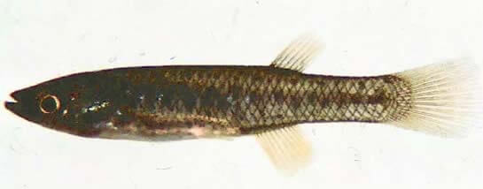

<content-header icon="estuarine_fish" title="Saltmarsh topminnow" subtitle="Fundulus jenkinsi">
</content-header>

<figcaption>Photo: FWC</figcaption>

### Overall vulnerability:

Very Low

### Conservation status:

State Threatened

## General Information

The saltmarsh topminnow is one of the smaller species of its genus, reaching 1.75 inches in length on average. These fish are brown in color with two rows of characteristic black dots along the body. The saltmarsh topminnow typically feeds on insects and small crustaceans such as amphipods. This species breeds between the months of March and August and can be expected to live approximately two years. Breeding is influenced by tidal patterns, with more breeding occurring during high tides.  Their range extends from Galveston Bay, Texas to the westernmost parts of the Florida panhandle.

## Habitat Requirements

The saltmarsh topminnow inhabits low-salinity estuaries and salt-marshes. Saltmarsh topminnows prefer habitats with abundant cordgrasses that provide shelter.

## Climate Impacts

Saltmarsh topminnows prefer low-salinity salt marshes and habitats and are therefore vulnerable to sea level rise. Increasing salinity associated with sea level rise and saltwater infiltration may be difficult for this species to tolerate.  In addition to altered salinity and water chemistry, rising temperatures in marsh habitats may negatively impact the saltmarsh topminnow through directly mortality or an overall decrease in habitat quality and availability of prey.

[More information about general climate impacts to species in Florida](/impacts/species).

## Vulnerability Assessment(s)

The overall vulnerability level (Very Low) was based on the following assessment(s).
#### 

<h3><a href="/impacts/vulnerability/sivva/species">Standardized Index of Vulnerability and Value Assessment</a></h3>

Slightly vulnerable

 

The primary factor contributing to vulnerability of the saltmarsh topminnow is sea level rise.

## Adaptation Strategies

- Conservation of existing marsh habitat will allow the saltmarsh topminnow the best chance of maintaining a healthy population as climate change begins to accelerate.

- Protecting salt marsh migration corridors may allow the minnow to migrate inland with marsh habitat as sea level rise occurs.  Areas further from coastal development where marsh migration has the highest chance of success should be prioritized.

[More information about adaptation strategies](/strategies).

## Additional Resources

- [Florida Fish and Wildlife Conservation Commission Species Profile](https://myfwc.com/wildlifehabitats/profiles/saltwater/saltmarsh-topminnow/)
