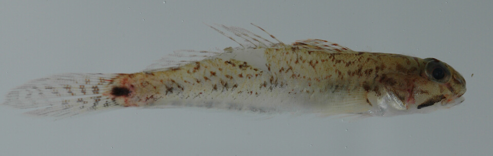

# Slashcheek goby

### Ctenogobius pseudofasciatus

<figcaption>Photo: Dr J. Van Tassell</figcaption>

### Overall vulnerability:

Very Low

### Conservation status:

Species of Greatest Conservation Need

## General Information

The slashcheek goby is a widely distributed estuarine fish with a range that includes the Atlantic coast of Florida, Central and South America and Belize.  This species is currently rare in Florida, likely due to habitat loss from coastal development and pollution.

## Habitat Requirements

This species occupies low-salinity estuaries and occasionally the lower reaches of rivers throughout its range.

**TODO: habitat crosslinks**

**TODO: habitat map (if exists)**

## Climate Impacts

The low-salinity brackish habitat slashcheek gobies prefer is threatened by increasing salinity associated with sea level rise and saltwater infiltration.  In addition to altered salinity and water chemistry, rising temperatures in estuarine habitat may negatively impact the goby through directly mortality or an overall decrease in habitat quality and availability of prey.  Coastal development and pollution are existing threats that are likely responsible for this fish’s decline in Florida.  Unfortunately, these threats are likely to increase along with climate change.

[More information about general climate impacts to species in Florida](/impacts/species).

## Vulnerability Assessment(s)

The overall vulnerability level (Very Low) was based on the following assessment(s).
#### 

<h3><a href="/impacts/vulnerability/sivva/species">Standardized Index of Vulnerability and Value Assessment</a></h3>

Slightly vulnerable

 

The primary factor contributing to vulnerability of the slashcheek goby is sea level rise.

## Adaptation Strategies

- Conservation and restoration of existing coastal habitat is critical to increase habitat and species health and resilience at the onset of intensifying climate change.

[More information about adaptation strategies](/strategies).

## Additional Resources

- [Other Species Profile](http://www.fishbase.se/summary/3863)
