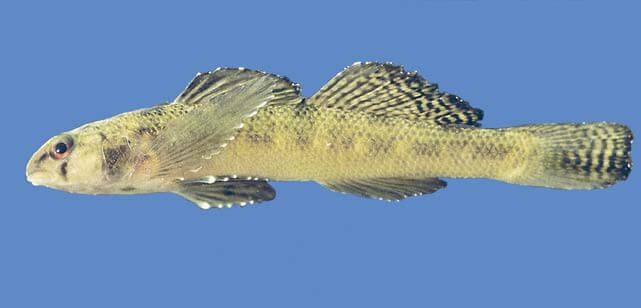

# Southern tessellated darter

### Etheostoma olmstedi maculaticeps

<figcaption>Photo: FWC</figcaption>

### Overall vulnerability:

This species was not assessed for vulnerability.

### Conservation status:

State Threatened

## General Information

This small brown darter inhabits a narrow geographic range extending from near the St. Johns River in northcentral Florida through North Carolina.  Darters are benthic fish named for their tendency to move between spots in short bursts of motion.  In between “darts” of movement they remain very still.  Male Southern tessellated darters have larger second dorsal fins than females, which they use to repel other males while protecting their nests. Females lay their eggs on smooth rocks where the largest male will then fertilize and guard the eggs. The Southern tessellated darter’s diet typically consists of insects, small fish, and crustaceans found in coastal streams.

## Habitat Requirements

Southern tessellated darters inhabit coastal streams, ranging from North Carolina to the St. Johns River in north-central Florida. This species is highly sensitive to water quality and flow levels within its narrow range.

**TODO: habitat crosslinks**

**TODO: habitat map (if exists)**

## Climate Impacts

The Southern tessellated darter occupies a relatively small geographic range, making it particularly vulnerable to changes in its surrounding habitat. This darter is sensitive to water quality in its habitat, leaving it vulnerable to increased sedimentation and pollution and changes in temperature, water chemistry and flow levels linked to climate change.  As many species begin to shift their ranges in response to climate change, Southern tessellated darters may be threatened by the increased presence of invasive species or hybridization with other species of darters.

[More information about general climate impacts to species in Florida](/impacts/species).

## Vulnerability Assessment(s)

This species was not assessed for vulnerability.

## Adaptation Strategies

- Prioritize key stream systems that are less vulnerable to climate change.   As this species is dependent on high water quality, focusing restoration and conservation efforts on the sites with the with the highest likelihood of resilience in a future climate may be an effective strategy.

[More information about adaptation strategies](/strategies).

## Additional Resources

- [Florida Fish and Wildlife Conservation Commission Species Profile](https://myfwc.com/wildlifehabitats/profiles/freshwater/southern-tesselated-darter/)
