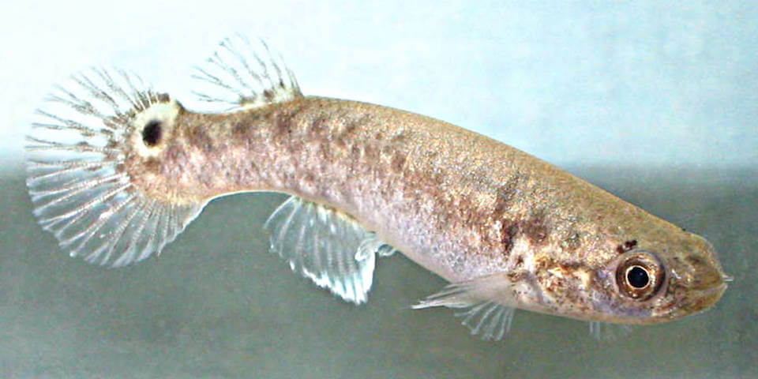

# Mangrove rivulus

### Kryptolebias marmoratus

<figcaption><a href="https://commons.wikimedia.org/w/index.php?curid=23915173" target="_blank" rel="noopener noreferrer">Photo: Cardet co6cs</a></figcaption>

### Conservation status:

Species of Greatest Conservation Need

### Overall vulnerability:

Not Assessed

The mangrove rivulus is a small, olive-colored marine fish. These fish primarily feed on worms, small crustaceans, mosquito larvae, and in dire situations, their own eggs.  Mangrove rivulus are hermaphroditic fish, having both male and female reproductive organs. This allows the mangrove rivulus to breed on its own, and create genetic copies of itself, a phenomenon that has not been observed in any other vertebrate thus far.

## Habitat Requirements

The mangrove rivulus inhabits mangrove forests along the coasts of the southern half of Florida. They can range from Florida’s coasts, down to southeastern Brazil. This amphibious fish spends much of its time on land. It can be found in small pools, crab burrows, logs, and moist leaf litter.

**TODO: habitat crosslinks**

**TODO: habitat map (if exists)**

## Climate Impacts

The mangrove forests this species inhabits are vulnerable to climate change and sea level rise. Warming temperatures, water flow patterns, water quantity, and water chemistry are all likely to change as climate change accelerates, reducing the amount of suitable habitat for this species. In addition to these climatic threats, the mangrove rivulus is currently threatened by mosquito control efforts, as mosquitos make up a large portion of this fish’s diet. Development of coastal areas as well as hurricanes can also physically diminish the availability of suitable habitat.

[More information about general climate impacts to species in Florida](/impacts/species).

## Vulnerability Assessment(s)

This species was not assessed for vulnerability.

## Adaptation Strategies

- Conservation and restoration of existing coastal habitat is critical to increase habitat and species health and resilience at the onset of intensifying climate change.

- Conserving healthy future mangrove habitat as sea levels rise and human communities begin to shift is important for this species.

- Protecting migratory corridors if mangrove habitat migrates inland and northward is an important adaptation strategy for this species.  Assisted migration to optimal mangrove habitat northward from the fish’s current range in a future climate is a possible strategy.

[More information about adaptation strategies](/strategies).

## Additional Resources

- [Florida Fish and Wildlife Conservation Commission Species Profile](https://myfwc.com/wildlifehabitats/profiles/saltwater/mangrove-rivulus/)
