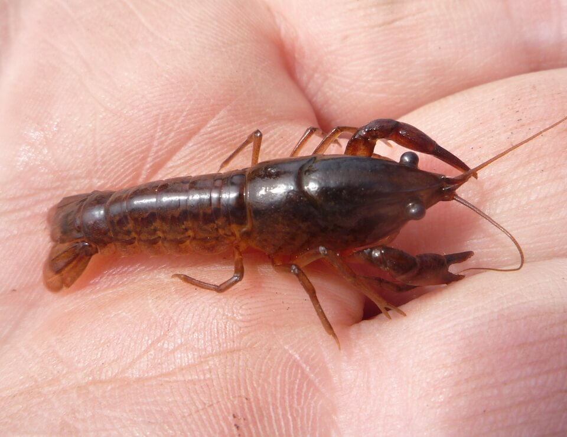

<content-header icon="freshwater_invertebrates" title="Panama City crayfish" subtitle="Procambarus econfinae"></content-header>

<figcaption>Photo: FWC - Amy Raybuck</figcaption>

### Overall vulnerability:

This species was not assessed for vulnerability.

<h3>Habitat area: 
<a href="/species/invertebrates/141/map" style="float:right;font-size:smaller;margin-right: 2rem;">
<fa-icon name="map"></fa-icon>
explore on map
</a>
</h3>

-   4,105 hectares within Florida (modeled)

### Conservation status:

State Species of Special Concern

## General Information

This small brown crayfish is endemic to a very narrow range in the Panama City area.  The Panama City crayfish burrows into the mud during drier times but is free-swimming when its wetland habitat is saturated with water.  Dead animals, plants and other organic matter form the bulk of this Crustacean’s diet.

## Habitat Requirements

The Panama City crayfish inhabits the freshwater flatwoods in and around Panama City, Florida.

**TODO: habitat crosslinks**

## Climate Impacts

The highly restricted range of this species coupled with its fragile, freshwater habitat leaves the Panama City crayfish highly vulnerable to a host of climate-related impacts.  This species is threatened by loss of the wetland habitat on which it relies.  Wetlands can dry up because of extensive drought and changes in the hydrological cycle triggered by climate change and are also at risk from encroaching human developed in the area, which is likely to accelerate with climate change.  Sea level rise and salt water infiltration are also major threats.  Because the range of this species is so small, severe storm events are also a special risk – the entire population could be at risk from one major hurricane in the area.

[More information about general climate impacts to species in Florida](/impacts/species).

#### This species is expected to be impacted by sea level rise:

- 3 meters of sea level rise: 2% of area (89 ha)
- 1 meter of sea level rise: <1% of area (13 ha)

[Explore sea level rise impacts map](/species/invertebrates/141/map).

## Vulnerability Assessment(s)

This species was not assessed for vulnerability.

## Adaptation Strategies

- Conservation and restoration of existing wetland habitat is critical to increase habitat and species health and resilience at the onset of intensifying climate change.

- Monitoring population levels and hydrological conditions is important for this species.

- Development of a captive breeding program for this species may warrant consideration.  If the population is wiped out by a major hurricane or storm surge event, a captive population could be used to repopulate the area.

[More information about adaptation strategies](/strategies).

## Additional Resources

- [Florida Fish and Wildlife Conservation Commission Species Profile](https://myfwc.com/wildlifehabitats/profiles/invertebrates/panama-city-crayfish/)
