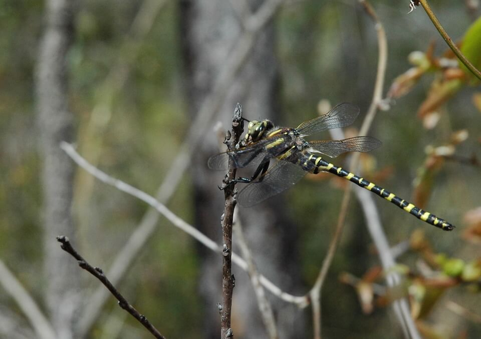

<content-header icon="terrestrial_invertebrates" title="Say’s spiketail (dragonfly)" subtitle="Cordulegaster sayi"></content-header>

<figcaption>Photo: Florida State Parks</figcaption>

### Overall vulnerability:

This species was not assessed for vulnerability.

### Conservation status:

Species of Greatest Conservation Need

## General Information

At only about 2.75 inches in adult length, this spiketail dragonfly is the smallest in its range.  It’s coloring distinguishes this species as does its size – the bright yellow ringed abdomen is easy to spot.  Adult Say’s spiketails are voracious predators, eating any flying insect they can catch, particularly bees and wasps.  They are understood to have a three-year larval period and are in flight during the early springtime across their Florida and Georgia range.

## Habitat Requirements

**Total habitat within Florida:** 7,506 hectares (modeled)

Say’s spiketail is endemic to the coastal plain sandhills of Florida and Georgia.  They prefer to forage in oak scrub habitats where they can find an ample supply of pollinating insects.  They breed in the mucky seeps alongside hardwood forests.

**TODO: habitat crosslinks**

**TODO: habitat map (if exists)**

## Climate Impacts

This species may be impacted by loss of breeding habitat within its range.  Seepage habitats can become degraded by fire suppression, contamination, flooding and invasive species – threats that are expected to increase under climate change.  Additional habitat fragmentation due to human activity is another concern.  Increasing temperatures, changing precipitation patterns, and shifting ecological community dynamics as the climate changes may also limit prey availability for the spiketail.

[More information about general climate impacts to species in Florida](/impacts/species).

## Vulnerability Assessment(s)

This species was not assessed for vulnerability.

## Adaptation Strategies

- Conservation and restoration of existing breeding habitat is important to increase habitat and species health and resilience at the onset of intensifying climate change.

- Monitoring population levels and hydrological conditions is important for this species.

[More information about adaptation strategies](/strategies).

## Additional Resources

- [Florida Natural Areas Inventory Profile](http://www.fnai.org/FieldGuide/pdf/Cordulegaster_sayi.pdf)
