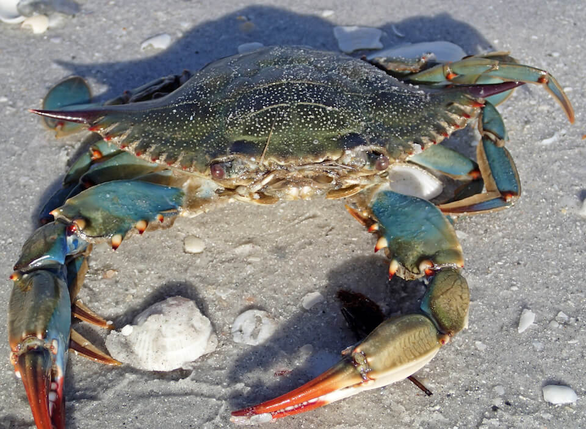

<content-header icon="marine_invertebrates" title="Blue crab" subtitle="Callinectes sapidus"></content-header>

<figcaption>Photo: James St. John</figcaption>

### Overall vulnerability:

Low

### Conservation status:

Not Listed

## General Information

The Greek and Latin roots of the crab’s scientific name translate roughly to “beautiful, tasty swimmer.” In keeping with that sentiment, this swimming crab is important to both recreational and commercial fisheries throughout its wide range in the waters of the Atlantic Ocean and the Gulf of Mexico.  Tasty to myriad aquatic predators as well, blue crabs are the natural prey of many species of fish and sharks.  They are highly opportunistic feeders in return – eating almost any type of plant or animal matter they can capture and serving an important role controlling invasive species in some ecosystems.

## Habitat Requirements

Blue crabs occupy large swaths of waters in the Atlantic and the Gulf of Mexico.  Crabs require different concentrations of salinity for different lifecycle stages, requiring higher salinity waters for spawning and hatching but spending most of their life in brackish waters.

**TODO: habitat crosslinks**

## Climate Impacts

The blue crab has multiple qualities that suggest resilience and the ability to adapt well to changing conditions under climate change.  Blue crabs have a wide range and a robust population with high genetic diversity.  They are also highly mobile and capable of traveling long distances to find favorable conditions.  While not highly vulnerable to the initial impacts of climate change, the blue crab may eventually be threatened by changing patterns in temperature and salinity that limit its ability to successfully mate and spawn.  This species is also susceptible to disease, a risk that could increase in the face of climate change.

[More information about general climate impacts to species in Florida](/impacts/species).

## Vulnerability Assessment(s)

The overall vulnerability level (Low) was based on the following assessment(s).
#### 

<h3><a href="/impacts/vulnerability/gcva">Gulf Coast Vulnerability Assessment</a></h3>

Low vulnererability

 

The blue crab is not likely to be negatively affected by climate change, sea level rise, and land use change.  Submerged structures, such as oyster reefs may be used as cover s marsh areas are converted to open water.  Blue crabs could potentially shift to new, more suitable  areas if salinity or sea surface temperatures change.  This species has multiple characteristics that support their ability to adapt to new environmental conditions, including having high mobility, a wide distribution, large populations, and high genetic diversity.

## Adaptation Strategies

- Responsible regulation and management of commercial and recreational blue crab fisheries is important for the long-term health and resilience of the population, especially under the added stress of climate change.

- Monitoring blue crab population levels and range shifts to gain knowledge on how changing conditions may be impacting crab populations is a useful first-step adaptation strategy for this species.

[More information about adaptation strategies](/strategies).

## Additional Resources

- [Florida Fish and Wildlife Conservation Commission Species Profile](https://myfwc.com/fishing/saltwater/recreational/blue-crab/)
