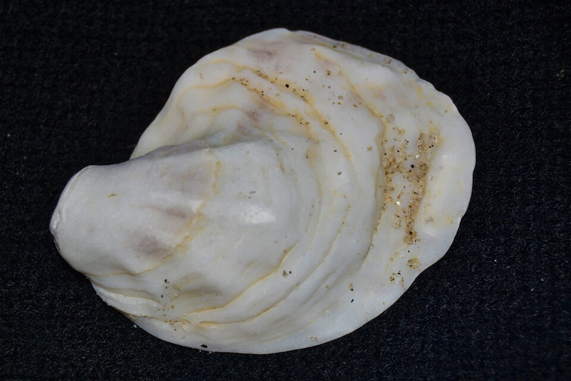

# Eastern oyster

### Crassostrea virginica

<figcaption><a href="https://commons.wikimedia.org/w/index.php?curid=38628727" target="_blank" rel="noopener noreferrer">Photo: Andrew C</a></figcaption>

### Overall vulnerability:

Moderate

### Conservation status:

Not Listed

## General Information

This species of mollusk occurs from the Gulf of St. Lawrence in Canada through the Bay of Campeche in Mexico and into the West Indies. An exceptionally important commercial fishery, oysters have suffered overharvesting throughout their history with humans, resulting in only a remaining fraction of their historic reef habitat.  There are two genetic stocks in the state of Florida, an Atlantic Coast stock and a Gulf stock. Eastern oysters are filter-feeders, subsisting on planktonic organisms and detritus. These mollusks have a 25-30-year lifespan and may grow to a size of 11.8 inches.  Reaching maturity at as young as four weeks of age, spawning is initiated and maintained with water temperatures of 20°C and salinities of 10 parts per thousand or higher.

Report Icons

## Habitat Requirements

Eastern oysters are found throughout coastal bays across their wide range. The ideal habitat for the Eastern oyster is a salt water area with large areas of open space featuring cliff sides and rock faces on which to attach.

**TODO: habitat crosslinks**

**TODO: habitat map (if exists)**

## Climate Impacts

Eastern oysters, though widespread, have an uneven range distribution, and are concentrated in the panhandle and Big Bend areas of Florida.  Historic overharvesting coupled with damage from natural events such as hurricanes has decimated the once plentiful complex reef structures this species is known for.  In addition to supporting oysters, reef habitat offers natural coastline protection from the impacts of climate change and numerous ecosystem services for other wildlife species.  Given the substantial existing threats this species faces, oysters are especially poorly equipped to handle additional climate-driven threats such as changes in salinity, increased runoff and pollution, storm surge events, and increased sedimentation.

[More information about general climate impacts to species in Florida](/impacts/species).

## Vulnerability Assessment(s)

The overall vulnerability level (Moderate) was based on the following assessment(s).
#### 

<h3><a href="/impacts/vulnerability/gcva">Gulf Coast Vulnerability Assessment</a></h3>

Moderately vulnerable

 

Eastern oysters were identified as moderately vulnerable across the gulf region.  Changes to the natural hydrological regime (input of freshwater) could negatively impact the eastern oyster.  Increased salinity may lead to increased predation from oyster drills.  Increased temperatures and salinity are associated with major outbreaks of disease and could extend predator's active period and range.  Runoff and storm surge can increase sedimentation, smothering oyster reefs, as well as bring in pollutants.

## Adaptation Strategies

- Protection of existing oyster reef habitat and responsible regulation preventing overharvest of this species is critical to help the Eastern oyster recover and maintain population stability at the onset of intensifying climate change.

- Living shorelines that create artificial oyster reef habitat using recycled shells or other materials is an adaptation strategy that offers multiple benefits.  In addition to providing habitat for the Eastern oyster, living shorelines support numerous other coastal wildlife species and offer protection against sea level rise, coastal erosion and storm surge events intensified by climate change.

[More information about adaptation strategies](/strategies).

## Additional Resources

- [Florida Fish and Wildlife Conservation Commission Species Profile](https://myfwc.com/media/12470/51-eastern-oyster-2016.pdf)
