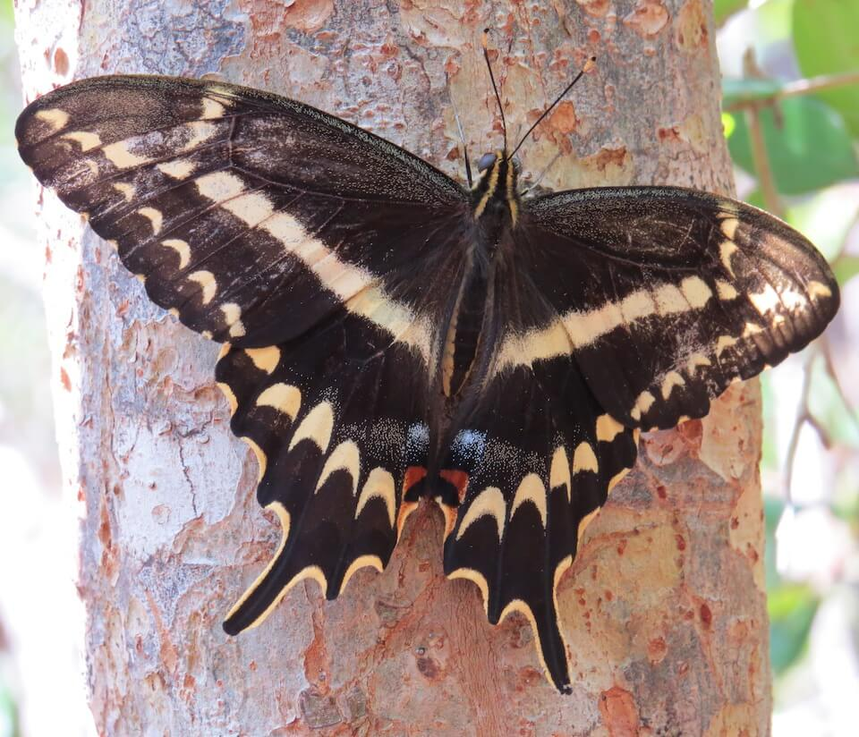

<content-header icon="terrestrial_invertebrates" title="Schaus swallowtail butterfly" subtitle="Heraclides aristodemus ponceanus"></content-header>

<figcaption>Photo: FWC</figcaption>

### Overall vulnerability:

Very High

### Conservation status:

Federally Endangered

## General Information

This striking black butterfly can have a forewing length of up to 2.3 inches.  The swallowtail’s dark wing is highlighted by white and yellow markings and the bottom of its wings have the characteristic swallowtail shape.  This species inhabits a very small geographic range in the Florida Keys and the southeastern tip of the peninsula.  Swallowtails produce one new generation each spring – caterpillars feed on spring blossoms and emerge as adults with the beginning of the rainy season each year.  Adults feed on a diet of guava nectar, wild tamarind and cheese shrubs.

## Habitat Requirements

Schaus’ swallowtails inhabit tropical hardwood hammocks, primarily found in Key Largo and Biscayne National Park.

**TODO: habitat crosslinks**

## Climate Impacts

Schaus’ swallowtails face considerable threats related to climate change within their limited range.  Habitat loss and fragmentation has been a large contributing factor in the butterfly’s past decline and is likely to increase with climate change.  Sea level rise also threatens the little amount of remaining swallowtail habitat.  Currently, this species exists in such small and isolated populations that it is highly vulnerable to extirpation or extinction from one extreme event, such as a strong storm or severe cold snap triggered by climate change.  The life cycle of this butterfly is also vulnerable to the seasonal changes associated with climate change.  As adult emergence is weather dependent, dramatic shifts in weather conditions will result in loss of a generation of this species.

[More information about general climate impacts to species in Florida](/impacts/species).

## Vulnerability Assessment(s)

The overall vulnerability level (Very High) was based on the following assessment(s).
#### 

<h3><a href="/impacts/vulnerability/sivva/species">Standardized Index of Vulnerability and Value Assessment</a></h3>

Extremely vulnerable

 

The primary factors contributing to vulnerability of the Schaus swallowtail butterfly are sea level rise, the presence of barriers, habitat fragmentation, changes in salinity, runoff and storm surge, synergies with development, and alterations to disturbance regimes.

## Adaptation Strategies

- While implementing an appropriate fire regime is extremely difficult in the Florida Keys, prescribed fire to the extent possible in combination with other maintenance techniques such as mechanical thinning is important to conserve optimal Schaus’ swallowtail habitat.

- As an endangered subspecies in an isolated location highly vulnerable to sea level rise, establishment of a captive breeding program is a long-term adaptation strategy for this butterfly.

[More information about adaptation strategies](/strategies).

## Additional Resources

- [Florida Fish and Wildlife Conservation Commission Species Profile](https://myfwc.com/wildlifehabitats/profiles/invertebrates/schaus-swallowtail-butterfly/)

- [Multi-Species Recovery Plan for South Florida](https://ecos.fws.gov/docs/recovery_plan/sfl_msrp/SFL_MSRP_Species.pdf)
