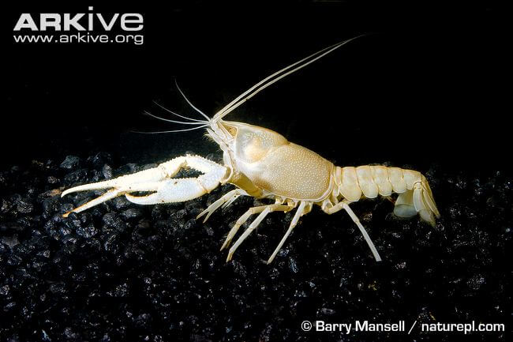

<content-header icon="freshwater_invertebrates" title="Sante Fe cave crayfish" subtitle="Procambarus erythrops"></content-header>

<figcaption>Photo: Barry Mansell</figcaption>

### Overall vulnerability:

This species was not assessed for vulnerability.

### Conservation status:

State Threatened

## General Information

Santa Fe Cave Crayfish are mid-sized crayfish that grow up to 3.5 inches and inhabit a narrow, northern Florida range. They are white with red eyes, largely due to the lack of sunlight in their habitats. These crayfish are thought to be detritovores, feeding on decaying organic matter. This species is thought to be breed in the springtime, between March and July.

## Habitat Requirements

Santa Fe crayfish inhabit groundwater including sinkholes and caves. They can be found in Suwannee and Columbia counties in northern Florida.

**TODO: habitat crosslinks**

## Climate Impacts

The main threat facing Santa Fe Cave Crayfish is loss of their limited habitat. Groundwater infiltration and pollution are major threats that are likely to be exacerbated by climate change. Changes in groundwater quality will greatly affect and impair this crayfish’s ability to survive. Both flooding and drought from the changing precipitation patterns associated with climate change can compromise the health of this population. Santa Fe cave crayfish are also at risk from fluctuating salinity due to sea level rise and extreme weather events.

[More information about general climate impacts to species in Florida](/impacts/species).

## Vulnerability Assessment(s)

This species was not assessed for vulnerability.

## Adaptation Strategies

- As current knowledge of this species is very limited, research aimed at improving knowledge of reproduction and population dynamics is a good first step to increasing the capacity to develop targeted adaptation strategies.

- Identifying and targeting conservation efforts in priority habitats areas that are at lower risk of being impacted by climate change may be a good strategy for this species.  Mapping the aquifer to determine the connectedness of different habitat sites is a first step in identifying priority sites.

[More information about adaptation strategies](/strategies).

## Additional Resources

- [Florida Fish and Wildlife Conservation Commission Species Profile](https://myfwc.com/wildlifehabitats/profiles/invertebrates/santa-fe-cave-crayfish/)
