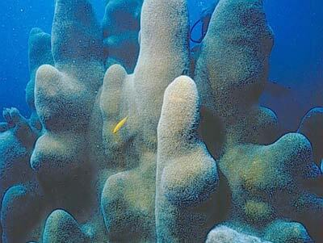

# Pillar coral

### Dendrogyra cylindrus

<figcaption>Photo: FWC</figcaption>

### Overall vulnerability:

This species was not assessed for vulnerability.

### Conservation status:

Federally Threatened

## General Information

Pillar Coral is a tan coral species that can reach up to eight feet in height and is made up of characteristic pillars of two to five inches in diameter. This coral, like many others, harbor symbiotic zooxanthellae that photosynthesize and provide energy for the coral. Pillar coral reproduce one week after the full moon in August, releasing eggs and sperm which get fertilized in the water column. The fertilized eggs become swimming larvae that will latch on to a substrate to develop into a new colony.

## Habitat Requirements

Pillar coral can be found in the warm waters of the Caribbean Sea and the Atlantic Ocean. They can range from the northern coast of South America to southern Florida, throughout the rocks, coral reefs, and sand substratum.

**TODO: habitat crosslinks**

**TODO: habitat map (if exists)**

## Climate Impacts

With the warming of ocean waters due to climate change, corals face the possibility of bleaching. Warmer temperatures become unfavorable for the symbiotic zooxanthellae, resulting in their expulsion from the coral. The coral loses its pigmentation when the zooxanthellae are expelled, losing a key source of food, eventually causing the coral to die. Along with the warming of water temperatures through global warming, increasing amounts of carbon dioxide are dissolved into the oceans. This lowers the pH of the waters, diminishing the calcification rates of corals. In addition, increasing intensity and frequency of large storms such as hurricanes pose a threat to coral populations, as these storms can cause physical damage to the reefs, harming the corals. Human interactions pose additional threats to coral populations through boat anchoring and physical manipulation of the corals.

[More information about general climate impacts to species in Florida](/impacts/species).

## Vulnerability Assessment(s)

This species was not assessed for vulnerability.

## Adaptation Strategies

- Creating markers above coral populations to prevent boating damage may help reduce existing non-climate-related threats.

- Encouraging the presence of beneficial species such as urchins through increased protections may benefit the health of these coral.

- Monitoring efforts including mapping the existing populations of pillar corals and conducting health assessments is an important first step to improve baseline knowledge.

[More information about adaptation strategies](/strategies).

## Additional Resources

- [Florida Fish and Wildlife Conservation Commission Species Profile](https://myfwc.com/wildlifehabitats/profiles/invertebrates/pillar-coral/)
