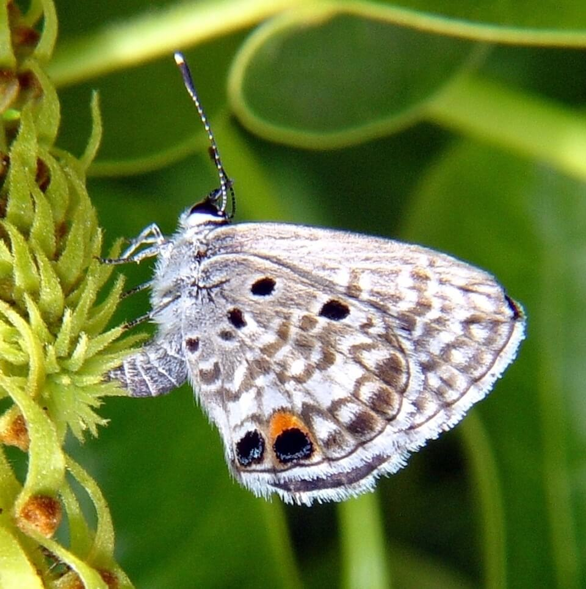

# Miami blue butterfly

### Cyclargus thomasi bethunebakeri

<figcaption>Photo: FWC</figcaption>

### Overall vulnerability:

Very High

### Conservation status:

Federally Endangered

## General Information

This small butterfly is named for its native range and for the bright blue coloring on its back, only visible when its wings are outstretched due to its dull, gray underside.  The butterfly’s historic range extended through coastal areas of the northern Florida peninsula but is currently limited to sporadic and fragile populations in the Florida Keys.  Miami blue’s are capable of producing more than one generation each year between February and November.

## Habitat Requirements

Miami blue butterflies are closely associated with their preferred host plants – balloonvine, gray nickerbean and blackbead.  Tropical hardwood hammocks, pine rocklands and beachside scrub in the Keys provides the best available current habitat for these butterflies.

**TODO: habitat crosslinks**

**TODO: habitat map (if exists)**

## Climate Impacts

The Miami blue butterfly is currently in a highly fragile state and far from a position to adapt well to the additional stress of a changing climate.  Habitat loss and fragmentation has been a large contributing factor in the butterfly’s past decline and is likely to increase with climate change.  Sea level rise also threatens the vast majority of Mimi blue habitat.  Currently, this species exists in such small and isolated populations that it is highly vulnerable to extirpation or extinction from one extreme event, such as a strong storm or severe cold snap triggered by climate change.

[More information about general climate impacts to species in Florida](/impacts/species).

## Vulnerability Assessment(s)

The overall vulnerability level (Very High) was based on the following assessment(s).
#### 

<h3><a href="/impacts/vulnerability/sivva/species">Standardized Index of Vulnerability and Value Assessment</a></h3>

Extremely vulnerable

 

The primary factors contributing to vulnerability of the Miami blue butterfly are sea level rise, the presence of barriers, habitat fragmentation, changes in salinity, runoff and storm surge, and alterations to biotic interactions and disturbance regimes.  This species has a very restricted range and is already very close to extirpation.  Biotic interactions that may be affected by climate change include changes in interactions with iguana and fire ants and interactions with use of insecticides.

## Adaptation Strategies

- While implementing an appropriate fire regime is extremely difficult in the Florida Keys, prescribed fire to the extent possible in combination with other maintenance techniques such as mechanical thinning is important to conserve the Miami blue’s pine rockland habitat.

- As an endangered species on an island location highly vulnerable to sea level rise, establishment of a captive breeding program is a long-term adaptation strategy for the Miami blue.

[More information about adaptation strategies](/strategies).

## Additional Resources

- [Florida Fish and Wildlife Conservation Commission Species Profile](https://myfwc.com/wildlifehabitats/profiles/invertebrates/miami-blue-butterfly/)
