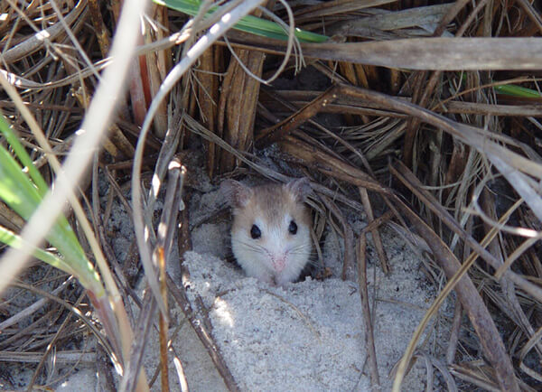

<content-header icon="rodents" title="Anastasia Island beach mouse" subtitle="Peromyscus polionotus phasma"></content-header>

<figcaption><a href="https://www.fws.gov/northflorida/species-accounts/beach-mice-2005.htm" target="_blank" rel="noopener noreferrer">Photo: Florida Department of Environmental Protection</a></figcaption>

### Overall vulnerability:

Moderate to High

### Conservation status:

Federally Endangered

## General Information

Relatively little is known about the Anastasia Island beach mouse, a subspecies of the small old-field mouse, now endemic only to Anastasia Island, Florida.  The mouse’s current geographic range is only a portion of its historic – this subspecies once extended north through Mickler’s Landing in St. Johns County.  The beach mouse can reach a length of 5 inches and has a pale colored back ranging from yellow-brown to grey-pink with a white tail and belly.  The Anastasia Island beach mouse is dependent on dune habitat for food and shelter, burrowing under dune vegetation and eating a diet of insects, seeds and fruit.   The species is monogamous and has the fast-reproductive cycle common of small mammals.  Breeding season typically occurs during the early winter months but can continue year-round in optimal food and climate conditions.

## Habitat Requirements

**Total habitat within Florida:** 709 hectares (modeled)

The Anastasia Island beach mouse relies exclusively on sand dune habitat vegetated by sea oats and dune panic grass.

**TODO: habitat crosslinks**

**TODO: habitat map (if exists)**

## Climate Impacts

As an endangered sub-species endemic to an island, the Anastasia Island beach mouse faces substantial threats related to climate change.  First, sea level rise is a grave impending threat to the beach mouse’s island habitat.  Additionally, this species faces many of the same existing threats common to coastal or island species: habitat loss and degradation from coastal development, barriers to migration, habitat disturbance from recreational use and high mortality from non-native predators.  These existing threats are likely to be magnified by the increasingly severe storm events and shifting conditions of a changing climate.

[More information about general climate impacts to species in Florida](/impacts/species).

#### This species is expected to be impacted by sea level rise:

- 3 meters of sea level rise: 89% of habitat (632 ha)
- 1 meter of sea level rise: 67% of habitat (477 ha)
    

## Vulnerability Assessment(s)

The overall vulnerability level (Moderate to High) was based on the following assessment(s).
#### 

<h3><a href="/impacts/vulnerability/sivva/species">Standardized Index of Vulnerability and Value Assessment</a></h3>

Highly vulnerable

 

The primary factors contributing to vulnerability of the Anastasia Island beach mouse are sea level rise, presence of barriers, habitat fragmentation, changes in salinity, runoff and storm surge, and alterations to disturbance regimes.  This species is already extirpated on non-protected lands.

## Adaptation Strategies

- Conservation of existing beach habitat will allow the Anastasia Island beach mouse the best chance of recovering and maintaining a healthy population as climate change begins to accelerate.  This includes controlling existing stressors, such as reducing populations of non-native predators.

- As sea level rise may eventually become too great a threat for the Anastasia Island beach mouse in its current habitat, developing and maintaining a captive breeding population is a strategy to consider for this island endemic subspecies.

[More information about adaptation strategies](/strategies).

## Additional Resources

- [Florida Fish and Wildlife Conservation Commission Species Profile](https://myfwc.com/wildlifehabitats/profiles/mammals/land/anastasia-island-beach-mouse/)

- [Federal Recovery Plan](https://ecos.fws.gov/docs/recovery_plan/930923b.pdf)
