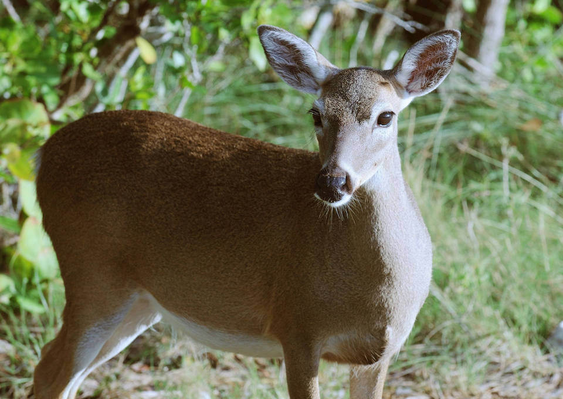

<content-header icon="large_mammals" title="Key deer" subtitle="Odocoileus virginianus clavium">
</content-header>

<figcaption>Photo: USFWS</figcaption>

### Overall vulnerability:

Very High

<h3>Habitat area: 
<a href="/species/mammals/119/map" style="float:right;font-size:smaller;margin-right: 2rem;">
<fa-icon name="map"></fa-icon>
explore on map
</a>
</h3>

-   6,219 hectares within Florida (modeled)

### Conservation status:

Federally Endangered

## General Information

The smallest subspecies of white-tailed deer, Key deer are found only the Florida Keys.  Key deer can swim between islands of the archipelago and their current range extends from Big Pine Key to Sugarloaf Key, reduced from their historical range spanning most of the Keys.  Habitat destruction and hunting decimated the Key deer population in the 1940s, with numbers falling to less than 50 individuals.  The current population has recovered to approximately 800 individuals.  Key deer are beloved and iconic in their native home.  As land area is limited in the Florida Keys, the Key deer is well adapted to tolerate sharing space with human.  In many areas, Key deer can be seen wandering in neighborhoods and other developed areas.

## Habitat Requirements

Key deer use all available habitats found within their range including areas populated by humans.  Pine rockland communities, unique pine flatwoods found exclusively on limestone substrate in southern Florida and the Keys, provide particularly critical habitat as they contain essential permanent freshwater sources.

## Climate Impacts

The Key deer is highly vulnerable to habitat loss stemming from sea level rise and land use change.  Limited by open water barriers preventing migration off the Florida Keys, Key deer are expected to lose 32-75% of useable habitat to sea level rise.  In addition to the direct threat of displacement, sea level rise will lead to increased salinity of freshwater drinking sources, a primary limiting resource for Key deer.  Drought, shifting hydrological conditions brought on by changes in precipitation patterns, and strong storm surge events may further increase salinization of freshwater sources.  Non-climate-related threats such as habitat fragmented by human development, highway mortality and the spread of disease and parasites linked to illegal feeding are also significant for this species.

[More information about general climate impacts to species in Florida](/impacts/species).

#### This species is expected to be impacted by sea level rise:

- 3 meters of sea level rise: 100% of area (6,219 ha)
- 1 meter of sea level rise: 100% of area (6,211 ha)

[Explore sea level rise impacts map](/species/mammals/119/map).

## Vulnerability Assessment(s)

The overall vulnerability level (Very High) was based on the following assessment(s).
#### 

<h3><a href="/impacts/vulnerability/ccvi">Climate Change Vulnerability Index</a></h3>

Highly vulnerable

 

The primary factors contributing to vulnerability of the Florida Key deer are sea level rise, the existence of natural barriers, the impact of potential changes in hydrology, and disturbance regimes on freshwater drinking sources.  In addition, the species has relatively low genetic variation, which could impact the species' evolutionary adaptive capacity.  Over 95% of the species' modeled potential habitat is expected to be impacted by a 1-meter sea level rise.  This species is restricted to the Florida Keys, with water surrounding the islands serving as a natural barrier to the species.  Key deer rely on freshwater for drinking - the primary sources for freshwater, freshwater holes and other freshwater wetlands, are threatened by saltwater incursion.  Increased intensity of hurricanes and associated storm surges are likely to affect Key deer under climate change.  Storm surges are a source of saline incursion and hurricanes are a source of direct mortality.

#### 

<h3><a href="/impacts/vulnerability/sivva/species">Standardized Index of Vulnerability and Value Assessment</a></h3>

Extremely vulnerable

 

The primary factors contributing to vulnerability of the Florida Key deer are sea level rise, the presence of barriers, changes in precipitation, habitat fragmentation, changes in salinity, runoff and storm surge, and alterations to biotic interactions.

## Adaptation Strategies

- Securing the availability of permanent, freshwater sources is an important adaptation strategy for the Key deer.  Gradual salination of freshwater sources due to sea level rise and immediate infiltration of saltwater into freshwater reserves following a storm event are both concerns for this species.

- While implementing an appropriate fire regime is extremely difficult in the Florida Keys, prescribed fire to the extent possible in combination with other maintenance techniques such as mechanical thinning is important to conserve the Key deer’s pine rockland habitat.

- As a subspecies inhabiting an island location highly vulnerable to sea level rise, assisted migration to an area where interbreeding with mainland whitetail deer is not possible or establishment of a captive breeding program is a long-term adaptation strategy.

[More information about adaptation strategies](/strategies).

## Additional Resources

- [Florida Fish and Wildlife Conservation Commission Species Profile](https://myfwc.com/wildlifehabitats/profiles/mammals/land/key-deer/)

- [Multi-Species Recovery Plan for South Florida](https://ecos.fws.gov/docs/recovery_plan/sfl_msrp/SFL_MSRP_Species.pdf)
