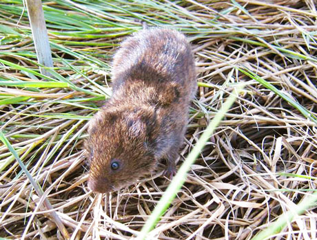

# Florida salt marsh vole

### Microtus pennsylvanicus dukecampbelli

<figcaption>Photo: Florida Wildlife Magazine</figcaption>

### Overall vulnerability:

Very High

### Conservation status:

Federally Endangered

## General Information

This dark brown mid-size rodent has an extremely narrow distribution within the state. Only two small populations of the Florida salt marsh vole are known to exist, both in the Big Bend region of Florida.  The Florida salt marsh vole eats a plant-based diet primarily consisting of grasses.  While little is known about the reproductive cycle of this species, Florida salt marsh voles are thought to breed year-round and reach sexual maturity very quickly at only one month old.

## Habitat Requirements

**Total habitat within Florida:** 13,810 hectares (modeled)

As with life history, knowledge of Florida salt marsh vole habitat is very limited.  This species has only been found in the saltgrass meadows that border black needlebrush within this vole’s limited range.

**TODO: habitat crosslinks**

**TODO: habitat map (if exists)**

## Climate Impacts

The Florida salt marsh vole is highly vulnerable to sea level rise because of its coastal habitat but this threat is greatly compounded by its conservation status and narrow range.  As climate change and rising seas make extreme weather, storm surge or flooding events more common near the coast, the very real possibility that this species could be wiped out by a single catastrophic event will increase.

[More information about general climate impacts to species in Florida](/impacts/species).

#### This species is expected to be impacted by sea level rise:

- 3 meters of sea level rise: 100% of habitat (13,810 ha)
- 1 meter of sea level rise: 100% of habitat (13,770 ha)
    

## Vulnerability Assessment(s)

The overall vulnerability level (Very High) was based on the following assessment(s).
#### 

<h3><a href="/impacts/vulnerability/sivva/species">Standardized Index of Vulnerability and Value Assessment</a></h3>

Extremely vulnerable

 

The primary factors contributing to vulnerability of the Florida salt marsh vole are sea level rise, presence of barriers, habitat fragmentation, changes in salinity, and runoff and storm surge.

## Adaptation Strategies

- Conservation of existing marsh habitat will allow the Florida salt marsh vole the best chance of recovering and maintaining a healthy population as climate change begins to accelerate.

- As sea level rise may eventually become too great a threat for the Florida salt marsh vole in its current habitat and range, developing and maintaining a captive breeding population and assisted migration to a new location are strategies to consider for this endangered species.

[More information about adaptation strategies](/strategies).

## Additional Resources

- [Florida Fish and Wildlife Conservation Commission Species Profile](https://myfwc.com/wildlifehabitats/profiles/mammals/land/florida-salt-marsh-vole/)
