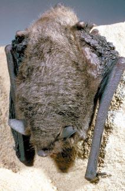

<content-header icon="bats" title="Gray bat" subtitle="Myotis grisescens">
</content-header>

<figcaption>Photo: FWC</figcaption>

### Overall vulnerability:

This species was not assessed for vulnerability.

<h3>Habitat area: 
<a href="/species/mammals/130/map" style="float:right;font-size:smaller;margin-right: 2rem;">
<fa-icon name="map"></fa-icon>
explore on map
</a>
</h3>

-   143,887 hectares within Florida (modeled)

### Conservation status:

Federally Endangered

## General Information

The gray bat can be identified by its solid dark gray coat which often bleaches to a pale rust color following their late summer molt.  The range of this species is fairly limited to the southeastern United States near limestone karst caves. The bat’s Florida distribution is limited to the northwestern region of the state.  Gray bats emerge in the evening to feed on flying insects along rivers or lakes.  Females give birth to a single pup each year in the spring.

## Habitat Requirements

Unlike some bat species known for roosting in housing, barns or other man-manmade structures, gray bats exclusively inhabit caves year-round.  They hibernate in deep, vertical limestone karst caves found along rivers in the southeastern United States.

## Climate Impacts

Climate change has the potential to impact many aspects of the gray bat’s life cycle and habitat.  Changes in seasonal temperature patterns could alter the gray bat’s natural hibernation cycle, resulting in critical energy loss if hibernation is cut short.  Cold snaps and frequent extreme weather events could impact prey availability.  An increase in the presence of pathogens in a warmer climate could also pose a grave threat to this species.  Additionally, many of the deep caves these bats inhabit are at risk of natural flooding.  A climate-triggered flooding event could be disastrous for the species given because an extremely large number of individuals inhabit a single cave.

[More information about general climate impacts to species in Florida](/impacts/species).

## Vulnerability Assessment(s)

This species was not assessed for vulnerability.

## Adaptation Strategies

- Monitoring and managing for the spread of new pathogens impacting this species is an important strategy as climate change is likely to spark the spread of novel disease-causing organisms. Gray bats are especially vulnerable to disease as large colonies live together in a single cave.

- Protecting current habitat is an important first step to ensure maximum population health and resilience in a changing climate.

[More information about adaptation strategies](/strategies).

## Additional Resources

- [Florida Fish and Wildlife Conservation Commission Species Profile](https://myfwc.com/wildlifehabitats/profiles/mammals/land/gray-bat/)

- [Federal Recovery Plan](https://ecos.fws.gov/docs/recovery_plan/820701.pdf)
