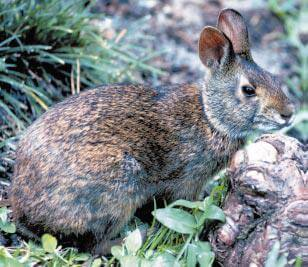

<content-header icon="small_mammals" title="Lower Keys marsh rabbit" subtitle="Sylvilagus palustris hefneri"></content-header>

<figcaption>Photo: FWC</figcaption>

### Overall vulnerability:

Very High

### Conservation status:

Federally Endangered

## General Information

This small brown mammal is the smallest of three subspecies of marsh rabbit found in the state. Endemic to the Florida Keys, the Lower Keys marsh rabbit eats a varied diet of herbaceous plants.  Marsh rabbits breed year-round with a peak season in the wintertime when they built nests of grass and fur for their young.  The drive to parent is strong in this species- females with go through a pseudo-pregnancy if they mate with an infertile male.  As do many small mammals, these marsh rabbits follow a fast reproductive cycle.  Females will often have 6-7 litters per year and once born, offspring are self-reliant at only 12-15 days.

## Habitat Requirements

**Total habitat within Florida:** 1,724 hectares (modeled)

The Lower Keys marsh rabbit typically inhabits higher elevation areas around fresh and salt water marshes in the Florida Keys from Big Pine Key to Boca Chica Key.

**TODO: habitat crosslinks**

**TODO: habitat map (if exists)**

## Climate Impacts

As an endemic Florida Keys species, the Lower Keys marsh rabbit faces substantial threats related to climate change.  First, sea level rise is a grave impending threat to the rabbit’s island habitat.  While this species prefers higher elevation areas, no location in the archipelago is equipped for substantial inundation from sea level rise.  Salination of rare and precious freshwater sources on the islands linked to sea level rise and storm surge is also a significant threat.  Additionally, this species faces many of the same existing threats common to coastal or island species: habitat loss and degradation from coastal development, barriers to migration, habitat disturbance from recreational use and high mortality from non-native predators.  Predation by feral cats is an especially significant threat to this species.  These existing threats are likely to be magnified by the shifting conditions of a changing climate.

[More information about general climate impacts to species in Florida](/impacts/species).

#### This species is expected to be impacted by sea level rise:

- 3 meters of sea level rise: 100% of habitat (1,724 ha)
- 1 meter of sea level rise: 100% of habitat (1,724 ha)
    

## Vulnerability Assessment(s)

The overall vulnerability level (Very High) was based on the following assessment(s).
#### 

<h3><a href="/impacts/vulnerability/ccvi">Climate Change Vulnerability Index</a></h3>

Extremely vulnerable

 

In the Florida Keys, marsh rabbits are highly vulnerable to sea level rise, with 100% of the modeled potential habitat impacted by a 1-meter sea level rise. Marsh rabbits are found in close proximity to water in a variety of habitats, including salt marsh, freshwater marsh, wet prairie, coastal beach berms, mangrove swamps, hammocks,  and vegetation along canals, ditches, and roadsides. Coastal and low lying freshwater marsh ecosystems will be vulnerable to sea level rise.  Storm surges associated with climate-related changes in hurricane intensity and/or frequency would have a potentially negative impact on marsh rabbits.

#### 

<h3><a href="/impacts/vulnerability/sivva/species">Standardized Index of Vulnerability and Value Assessment</a></h3>

Extremely vulnerable

 

The primary factors contributing to vulnerability of the Lower Keys mash rabbit are sea level rise, erosion, presence of barriers, changes in precipitation, minimal habitat protection, habitat fragmentation, changes in salinity, runoff and storm surge, and alterations to biotic interactions.

## Adaptation Strategies

- Controlling existing threats such as feral cats is an important first-step in increasing marsh rabbit population resilience and ability to adapt.

- Securing the availability of permanent, freshwater sources is an important adaptation strategy for the Lower Keys marsh rabbit.  Gradual salination of freshwater sources due to sea level rise and immediate infiltration of saltwater into freshwater reserves following a storm event are both concerns for this species.

- Conservation of existing habitat including partnering with other organizations to reach mutual goals in restoration efforts is an important step in maintaining a healthy population as climate change begins to accelerate.

- As sea level rise may eventually become too great a threat for this species in its current habitat, developing and maintaining a captive breeding population is a strategy to consider for this island endemic.

[More information about adaptation strategies](/strategies).

## Additional Resources

- [Florida Fish and Wildlife Conservation Commission Species Profile](https://myfwc.com/wildlifehabitats/profiles/mammals/land/lower-keys-rabbit/)

- [Multi-Species Recovery Plan for South Florida](https://ecos.fws.gov/docs/recovery_plan/sfl_msrp/SFL_MSRP_Species.pdf)
