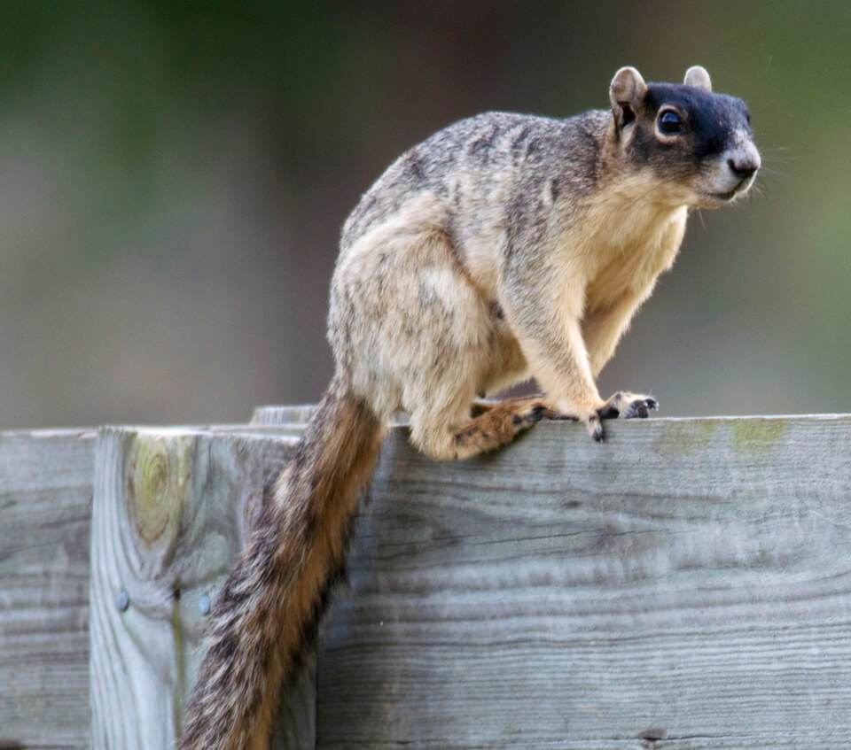

<content-header icon="rodents" title="Sherman’s fox squirrel" subtitle="Sciurus niger shermani"></content-header>

<figcaption>Photo: FWC</figcaption>

### Overall vulnerability:

Very Low

<h3>Habitat area: 
<a href="/species/mammals/153/map" style="float:right;font-size:smaller;margin-right: 2rem;">
<fa-icon name="map"></fa-icon>
explore on map
</a>
</h3>

-   1,529,628 hectares within Florida (modeled)

### Conservation status:

State Species of Special Concern

## General Information

The Sherman’s fox squirrel is one of four subspecies of fox squirrel found in Florida, with a geographic range including parts of central and northeastern Florida up to central Georgia.  Sherman’s fox squirrels are large and variable in color with robust, bushy tails.   Sherman’s fox squirrels primarily forage on oak acorns and pine seeds but occasionally consume other foods such as fungi, fruit and buds.  These squirrels have a winter and a summer breeding season each year, during which they build soft nests of Spanish moss in oak trees.

## Habitat Requirements

Sherman’s fox squirrels are primarily tree-dwelling and inhabit open areas of fire-maintained longleaf pine, oak, sandhill and flatwoods habitat.

**TODO: habitat crosslinks**

## Climate Impacts

Sherman’s fox squirrels are already highly threatened by habitat loss with only an estimated 15% of their historic habitat remaining intact.  The arid land they inhabit in central Florida is well-suited for agricultural and has been lost to that purpose over the past century.  Additional fragmentation of the limited remaining Sherman’s fox squirrel habitat is likely as climate change pushes human populations inland from the coast.  Fire suppression also degrades the quality of fire-maintained fox squirrel longleaf pine habitat.  Fire suppression is likely to become more of a problem in a future climate where it is more difficult to implement an appropriate fire regime.

[More information about general climate impacts to species in Florida](/impacts/species).

#### This species is expected to be impacted by sea level rise:

- 3 meters of sea level rise: 5% of area (75,163 ha)
- 1 meter of sea level rise: 2% of area (25,180 ha)

[Explore sea level rise impacts map](/species/mammals/153/map).

## Vulnerability Assessment(s)

The overall vulnerability level (Very Low) was based on the following assessment(s).
#### 

<h3><a href="/impacts/vulnerability/sivva/species">Standardized Index of Vulnerability and Value Assessment</a></h3>

Slightly vulnerable

 

The primary factors contributing to vulnerability of the Sherman's fox squirrel are habitat fragmentation, alterations to biotic interactions and disturbance regimes, and synergies with development.

## Adaptation Strategies

- Implementing an appropriate fire regime for as long as possible will increase habitat resilience to climate change.  Alternative habitat management methods that can be used when fire is not possible should also be explored.

- Given the high degree of habitat fragmentation already present within the squirrel’s range, protecting connected patches of habitat wherever possible should be prioritized.

[More information about adaptation strategies](/strategies).

## Additional Resources

- [Florida Natural Areas Inventory Profile](https://www.fnai.org/FieldGuide/pdf/Sciurus_niger_shermani.pdf)
