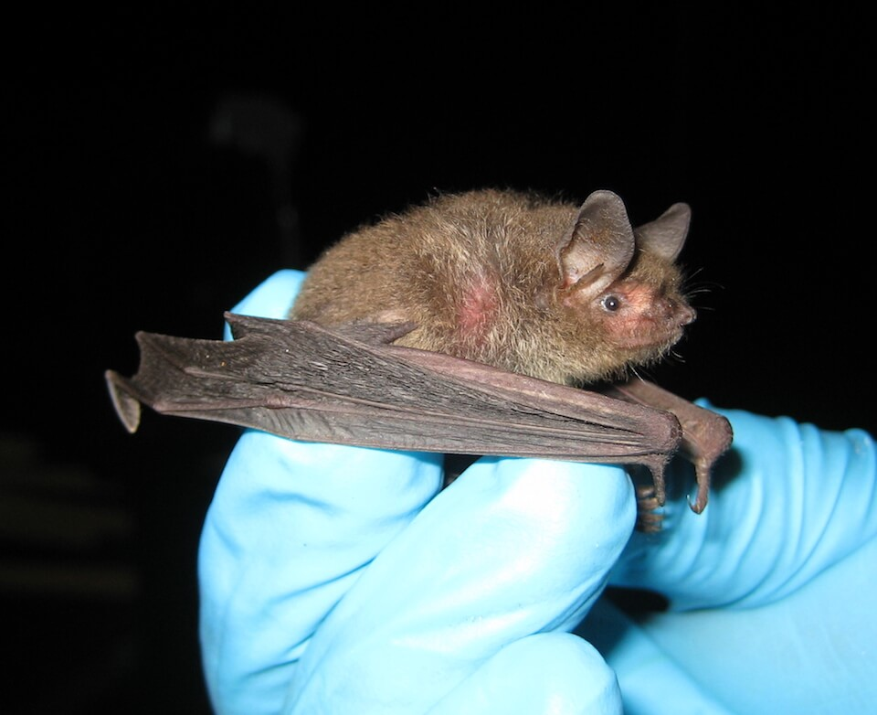

<content-header icon="bats" title="Southeastern bat" subtitle="Myotis austroriparius">
</content-header>

<figcaption>Photo: FWC</figcaption>

### Overall vulnerability:

This species was not assessed for vulnerability.

<h3>Habitat area: 
<a href="/species/mammals/160/map" style="float:right;font-size:smaller;margin-right: 2rem;">
<fa-icon name="map"></fa-icon>
explore on map
</a>
</h3>

-   1,149,239 hectares within Florida (modeled)

### Conservation status:

Species of Greatest Conservation Need

## General Information

This medium-sized bat has a grayish-brown back and a yellow belly.  This species occurs throughout the Florida panhandle and northern peninsula. Southeastern bats mate in the fall but females delay fertilization until the spring, giving birth to two pups each in early May.  These bats feed mostly on mosquitos, but supplement their diets with other small insects such as crane flies and moths.

## Habitat Requirements

While Southeastern bats primarily establish colonies in caves, they have also been known to inhabit other structures including hollow trees, bridges, buildings and humanmade bat houses.

## Climate Impacts

Climate change has the potential to impact many aspects of the Southeastern bat’s life cycle and habitat.  Changes in seasonal temperature patterns could alter bat behavior and energy conservation.  Although Southeastern bats do not experience extended torpor as do other bat species, they have been documented to use short-term torpor during cold spells.  Cold snaps and frequent extreme weather events could alter their ability to maintain and conserve energy without extended periods of torpor and could impact prey availability.  An increase in the presence of pathogens in a warmer climate could also pose a grave threat to this species.  Additionally, many caves and other structures these bats inhabit are at risk of natural flooding, a risk likely to increase under climate change.

[More information about general climate impacts to species in Florida](/impacts/species).

#### This species is expected to be impacted by sea level rise:

- 3 meters of sea level rise: 28% of area (324,138 ha)
- 1 meter of sea level rise: 13% of area (146,474 ha)

[Explore sea level rise impacts map](/species/mammals/160/map).

## Vulnerability Assessment(s)

This species was not assessed for vulnerability.

## Adaptation Strategies

- Monitoring and managing for the spread of new pathogens impacting this species is an important strategy as climate change is likely to spark the spread of novel disease-causing organisms. Bat are especially vulnerable to disease as large colonies live together in a very close proximity.

- Protecting current habitat is an important first step to ensure maximum population health and resilience in a changing climate.

- As Southeastern bats will colonize bat houses and other humanmade structures, creation of artificial shelter is a possible adaptation strategy for this species should natural habitat decline significantly in a future climate.

[More information about adaptation strategies](/strategies).

## Additional Resources

- [Florida Natural Areas Inventory Profile](http://www.fnai.org/FieldGuide/pdf/Myotis_austroriparius.pdf)
