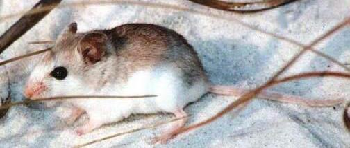

# St. Andrew beach mouse

### Peromyscus polionotus peninsularis

<figcaption>Photo: USFWS</figcaption>

### Overall vulnerability:

Moderate

### Conservation status:

Federally Endangered

## General Information

Very little is known about the life history of the St. Andrew beach mouse, a subspecies of the small old-field mouse, endemic to a small range from the dunes of St. Joseph Peninsula in Gulf County, Florida to near St. Andrew Bay in Bay County, Florida.  The beach mouse can reach a length of 5 inches.  The St. Andrew beach mouse is dependent on dune habitat for food and shelter, burrowing under dune vegetation and eating a diet of insects, seeds and fruit.   The species is monogamous and has the fast-reproductive cycle common of small mammals.  Breeding season typically occurs during the early winter months but can continue year-round in optimal food and climate conditions.

## Habitat Requirements

**Total habitat within Florida:** 1,010 hectares (modeled)

The St. Andrew beach mouse relies exclusively on sand dune habitat on the Gulf coast of the Florida panhandle.

**TODO: habitat crosslinks**

**TODO: habitat map (if exists)**

## Climate Impacts

As a coastal endemic subspecies, the St. Andrew beach mouse faces substantial threats related to climate change.  First, sea level rise is a grave impending threat to the beach mouse’s island habitat.  Additionally, this species faces many of the same existing threats common to coastal or island species: habitat loss and degradation from coastal development, barriers to migration, habitat disturbance from recreational use and high mortality from non-native predators.  These existing threats are likely to be magnified by the increasingly severe storm events and shifting conditions of a changing climate.

[More information about general climate impacts to species in Florida](/impacts/species).

#### This species is expected to be impacted by sea level rise:

- 3 meters of sea level rise: 69% of habitat (701 ha)
- 1 meter of sea level rise: 18% of habitat (179 ha)
    

## Vulnerability Assessment(s)

The overall vulnerability level (Moderate) was based on the following assessment(s).
#### 

<h3><a href="/impacts/vulnerability/sivva/species">Standardized Index of Vulnerability and Value Assessment</a></h3>

Moderately to Highly vulnerable

 

The primary factors contributing to vulnerability of the St. Andrew beach mouse are sea level rise, habitat fragmentation, changes in salinity, runoff and storm surge, and alterations to disturbance regimes.  This species is already extirpated on non-protected lands.

## Adaptation Strategies

- Conservation of existing beach habitat will allow the beach mouse the best chance of recovering and maintaining a healthy population as climate change begins to accelerate.  This includes controlling existing stressors, such as reducing populations of non-native predators.

- As sea level rise may eventually become too great a threat for the St. Andrew beach mouse in its current habitat, developing and maintaining a captive breeding population is a strategy to consider for this coastal endemic subspecies.

[More information about adaptation strategies](/strategies).

## Additional Resources

- [Florida Fish and Wildlife Conservation Commission Species Profile](https://myfwc.com/wildlifehabitats/profiles/mammals/land/st-andrew-beach-mouse/)

- [Federal Recovery Plan](https://ecos.fws.gov/docs/recovery_plan/20110104_SABM_recov_plan_FINAL.pdf)
