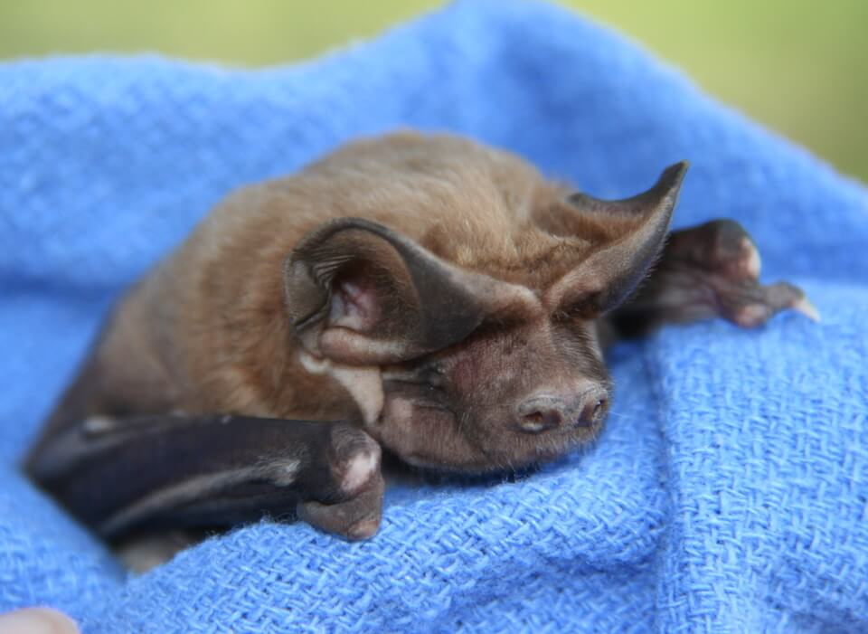

<content-header icon="bats" title="Florida bonneted bat" subtitle="Eumops floridanus"></content-header>

<figcaption>Photo: FWC</figcaption>

### Overall vulnerability:

High

### Conservation status:

Federally Endangered

## General Information

The Florida bonneted bat is also referred to as the Florida mastiff bat because its substantial size.  This species is the largest bat in Florida, reaching a length of 6.5 inches long with a wingspan of 20 inches. Very little is known about this rare species – the Florida bonneted bat is restricted to a small handful of counties in south Florida, one of the most restricted ranges of any species of bat in the United States.  Florida bonneted bats have been observed foraging in several habitat types and are thought to eat a diet primarily consisting of flying insects.

## Habitat Requirements

Very few roosting sites have been documented for this species within its tiny South Florida range.  Florida bats have successfully used artificial roosting structures such as bat houses, but the use of such structures has not been fully explored with this species.  Florida bats have been observed foraging in various habitats including semitropical hardwood forests, mangroves and suburban areas such as gulf courses and neighborhoods.

**TODO: habitat crosslinks**

## Climate Impacts

The limited distribution of this species leaves the Florida bonneted bat especially vulnerable to climate-related major disturbance events such as a strong hurricane or severe drought that could impact the population of this species over its entire range.  As are many species in south Florida, these bats are currently threatened by habitat loss and roost site destruction that is likely to expand with changing land use patterns in response to climate change.  The presence of novel pathogens is another increased risk associated with climate change that may impact this species – bats are highly susceptible to disease given their proclivity to roosting in very close proximity to each other.

[More information about general climate impacts to species in Florida](/impacts/species).

## Vulnerability Assessment(s)

The overall vulnerability level (High) was based on the following assessment(s).
#### 

<h3><a href="/impacts/vulnerability/ccvi">Climate Change Vulnerability Index</a></h3>

Moderately vulnerable to Presumed stable

 

The distribution and ecology for the Florida bonneted bat is very poorly understood.   It is estimated that between 10-20% of the species' range will be impacted by a 1-meter sea level rise. The species relies on hydric habitats for foraging areas, but there is uncertainty regarding the impact of climate change on those habitats. For example, drier conditions could potentially limit insect production in foraging habitats.  Many of the metrics for the vulnerability assessment could not be assessed, due to lack of available information. The vulnerability rank for this species, which ranged from "Moderately Vulnerable" to "Not Vulnerable/Presumed Stable" within Florida, depending on the distribution data used to parameterize the CCVI.

#### 

<h3><a href="/impacts/vulnerability/sivva/species">Standardized Index of Vulnerability and Value Assessment</a></h3>

Highly vulnerable

 

The primary factors contributing to vulnerability of the Florida bonneted bat are sea level rise, presence of barriers, minimal habitat protection, and habitat fragmentation.

## Adaptation Strategies

- Monitoring and managing for the spread of new pathogens impacting this species is an important strategy as climate change is likely to spark the spread of novel disease-causing organisms.

- Protecting current habitat is an important first step to ensure maximum population health and resilience in a changing climate.

- As Florida bonneted bats have been documented to colonize bat houses and other humanmade structures, creation of artificial shelter is a possible adaptation strategy for this species should natural habitat decline significantly in a future climate.  This strategy should be further explored for the Florida bonneted bat.

[More information about adaptation strategies](/strategies).

## Additional Resources

- [Florida Fish and Wildlife Conservation Commission Species Profile](https://myfwc.com/wildlifehabitats/profiles/mammals/land/florida-bonneted-bat/)
